# 📡 Diagnóstico Técnico de Integração: DEXExtension, Versionamento e Incompatibilidades do Matcher DEX

Este documento apresenta uma análise exaustiva e de nível de produção sobre o mecanismo de acoplamento entre o **AMZX Node** (Blockchain) e o **Matcher DEX** por meio da extensão gRPC de baixo nível **`DEXExtension`**. Ele detalha os fatores fundamentais que causam a atual incompatibilidade de versões e impedem o funcionamento correto do Matcher no ecossistema atualizado, fornecendo o roteiro técnico exato para sincronização e resolução definitiva do problema.

---

## 🔌 1. A Extensão de Transações de Trade (`DEXExtension`)

No ecossistema AMZX, o **Matcher DEX** é projetado para rodar de forma isolada do processo de consenso para preservar recursos. No entanto, para fins de liquidação, cálculo de taxas de ordens em contratos complexos e verificação em tempo real de saldos, ele exige uma transmissão de eventos on-chain com latência quase nula. 

Essa conexão é estabelecida pela classe [`DEXExtension`](file:///home/diegooris/Documentos/amzblockchain/matcher/waves-ext/src/main/scala/com/wavesplatform/dex/grpc/integration/DEXExtension.scala), um componente dinâmico desenvolvido em Scala que roda acoplado diretamente dentro da JVM do nó da blockchain.

### Fluxo de Funcionamento e Arquitetura de Streams

```mermaid
sequenceDiagram
    participant Node as AMZX Blockchain Node (JVM)
    participant Ext as DEXExtension (gRPC Server - Porta 6887)
    participant Matcher as Matcher DEX Engine (JVM Separada)

    Node->>Ext: Registra gRPC Services na inicialização
    Note over Ext: Carregada via reflexão (amzx.extensions)
    Matcher->>Ext: Estabelece Canal gRPC (Porta 6887)
    Ext-->>Matcher: Stream de Conexão Inicializado (gRPC Stream)
    
    rect rgb(20, 30, 45)
        Note over Node, Matcher: Pipeline de Eventos em Tempo Real (Event Streaming)
        Node->>Node: Novo bloco minerado / micro-bloco
        Node->>Ext: Intercepta e propaga UtxEvent & BlockEvent
        Ext->>Matcher: Envia Blockchain Updates (protobuf)
        Matcher->>Matcher: Atualiza livro de ofertas & saldos em cache
    end
```



A `DEXExtension` realiza o seguinte pipeline:
1. **Injeção via Reflexão**: O Nó lê o array de extensões em seu arquivo de configuração HOCON (`amzx.extensions += "com.wavesplatform.dex.grpc.integration.DEXExtension"`). Ao iniciar, o carregador de classes do Nó instancia a `DEXExtension` fornecendo uma instância de `com.wavesplatform.extensions.Context`.
2. **Exposição gRPC**: A extensão inicializa um servidor Netty gRPC embutido na porta `6887` (configurável) e registra o serviço [`WavesBlockchainApiGrpcService`](file:///home/diegooris/Documentos/amzblockchain/matcher/waves-ext/src/main/scala/com/wavesplatform/dex/grpc/integration/DEXExtension.scala#L25-L48).
3. **Barramento de Eventos de Alta Velocidade**: O serviço se inscreve diretamente nos barramentos de memória do nó (como `utxEvents` e eventos de blocos), empacota os dados brutos de transações, hashes e atualizações de balanço usando estruturas Protocol Buffers compactas e envia streams bidirecionais contínuos para o processo do Matcher.

---

## ⚡ 2. Por que o Matcher não está atualmente Atualizado e Funcional?

Ao executar o Matcher contra o nó AMZX atualizado, ocorrem falhas catastróficas de carregamento e incompatibilidade de classes na JVM (como `NoClassDefFoundError`, `NoSuchMethodError` e `LinkageError`). 

A análise profunda das árvores de dependência dos subprojetos [`waves/`](file:///home/diegooris/Documentos/amzblockchain/waves/build.sbt) e [`matcher/`](file:///home/diegooris/Documentos/amzblockchain/matcher/build.sbt) revelou **quatro causas principais** para essa incompatibilidade estrutural:

### A. Divergência Crítica de Versão do Compilador Scala (Incompatibilidade Binária)
*   **AMZX Node**: Foi migrado com sucesso para o compilador **Scala 3.8.3** (JVM 17 nativa).
*   **Matcher DEX**: Permanece configurado na versão legado **Scala 2.13.6** (definido globalmente no escopo do Matcher como `scalaVersion := "2.13.6"`).
*   **O Mecanismo da Falha**: Embora a biblioteca padrão do Scala 3 ofereça alguma interoperabilidade retroativa para consumo de pacotes compiled com 2.13, a **DEXExtension é um plugin dinâmico**. Ela precisa estender traços (`Extension`) e receber interfaces de contexto (`Context`) compilados em Scala 3. O carregamento de assinaturas de métodos com tipos complexos (como coleções nativas, mônadas Monix ou tipos de efeitos do Cats) compilados em Scala 2.13 para dentro de um contexto rodando Scala 3 quebra a compatibilidade binária da JVM no momento da reflexão (`Class.forName`), impedindo a inicialização do Nó.

### B. Conflito Estrutural de Ecossistema: Akka vs. Apache Pekko (Namespaces)
*   **AMZX Node**: Para mitigar as restrições de licenciamento comercial introduzidas pela Lightbend no Akka, a blockchain AMZX migrou totalmente para o ecossistema **Apache Pekko 1.6.0** e **Pekko HTTP 1.3.0** (usando o namespace `org.apache.pekko`).
*   **Matcher DEX**: O código do Matcher e o módulo `waves-ext` continuam acoplados ao ecossistema legado **Lightbend Akka 2.6.15** e **Akka HTTP 10.2.6** (utilizando o namespace `com.typesafe.akka`).
*   **O Mecanismo da Falha**:
    Na classe `DEXExtension.scala`, o despachante de threads gRPC é obtido a partir do sistema de atores fornecido pelo nó:
    ```scala
    implicit private val apiScheduler: Scheduler = Scheduler(
      ec = context.actorSystem.dispatchers.lookup("akka.actor.waves-dex-grpc-scheduler"),
      executionModel = ExecutionModel.AlwaysAsyncExecution
    )
    ```
    Como o nó atualizado usa Pekko, a interface `Context` que ele passa para a extensão **não contém mais a classe Akka `ActorSystem`**, mas sim a versão Pekko. Isso resulta em uma exceção imediata:
    `java.lang.NoClassDefFoundError: com/typesafe/akka/actor/ActorSystem` ou falha equivalente ao tentar mapear referências entre bibliotecas que usam namespaces mutuamente exclusivos (`com.typesafe.akka` contra `org.apache.pekko`).

### C. Acoplamento Cego via Artefatos Pré-compilados do GitHub (`WavesNodeArtifactsPlugin`)
*   O módulo do Matcher [`waves-ext/build.sbt`](file:///home/diegooris/Documentos/amzblockchain/matcher/waves-ext/build.sbt) utiliza um plugin customizado chamado `WavesNodeArtifactsPlugin` para baixar binários do nó e compilar o código de extensão.
*   Esse plugin está fixado globalmente para buscar a versão legado **`1.4.13`** oficial da Waves do GitHub:
    ```scala
    Global / wavesNodeVersion := "1.4.13"
    ```
*   **O Mecanismo da Falha**: O compilador do Matcher baixa o arquivo `waves-all-1.4.13.jar` pré-compilado (em Scala 2.13 e Akka) e compila a `DEXExtension` contra este JAR de referência legado. Consequentemente, a extensão gerada é gerada sob medida para uma versão antiga e centralizada do software Waves, ignorando completamente as alterações estruturais de criptografia (como assinaturas Ethereum), suporte a EVM e migração de consensus feitas localmente no código-fonte em `waves/`.

### D. Colisão de Versão da Biblioteca de Runtime Protobuf
*   **AMZX Node**: Usa o Google Protobuf Java versão **`4.35.0`** (conforme `waves/project/Dependencies.scala`).
*   **Matcher DEX**: Usa um runtime Protobuf legado acoplado ao `grpc-netty` versão **`1.35.0`** e compiladores `scalapb` antigos (compatíveis com Scala 2.13).
*   **O Mecanismo da Falha**: Ao tentar deserializar pacotes gRPC contendo estruturas de transações ou blocos, a JVM acusa erros de linking de métodos inexistentes (`NoSuchMethodError` na classe `GeneratedMessageV3`) porque os stubs de código gerados no Matcher buscam heranças e assinaturas da API Protobuf v3, enquanto a memória do Nó possui carregado apenas as classes e convenções modernas da API Protobuf v4.

### E. Versão Específica do Java (OpenJDK 17) e Versões de Scala (Compatibilidade Oficial)
*   **Requisito Oficial do Nó**: Conforme estabelecido no guia de inicialização e build do repositório da Blockchain (`waves/README.md`), o ambiente de runtime recomendado e suportado oficialmente para execução estável é o **OpenJDK 17** (e não o JDK 21).
*   **Compiladores do Ecossistema**:
    *   **AMZX Node (Blockchain)**: Sintonizado na versão moderna **Scala 3.8.3**.
    *   **Matcher DEX**: Configurado e compilado sob a versão **Scala 2.13.14** (anteriormente Scala 2.13.6).
*   **O Mecanismo da Falha**: Embora o JDK 21 ofereça suporte à maioria dos bytecode gerados, as otimizações internas do ecossistema e certas interações de reflexão profunda (como manipulações de classloaders e injeção do plugin da `DEXExtension` na JVM) são validadas de ponta a ponta e otimizadas especificamente para o compilador e runtime do **Java 17**. O uso do JDK 21 pode induzir a comportamentos inesperados e quebras de linkage desnecessárias durante a fusão em tempo real de streams gRPC.
*   **Solução Recomendada**: Padronizar e executar todo o ambiente de testes e de produção (nó e matcher) utilizando estritamente a JVM do **OpenJDK 17** instalado localmente em `/usr/lib/jvm/java-1.17.0-openjdk-amd64/`.

---

## 🛠️ 3. O que precisa ser Alterado na Blockchain ou no Matcher?

Para restabelecer a comunicação completa e permitir a execução síncrona do Matcher e da `DEXExtension` com o Nó do ecossistema AMZX, as seguintes correções de engenharia de compilação e código são necessárias:

### 🔄 Modificações Críticas no Matcher DEX

As alterações devem focar na atualização da pilha tecnológica do Matcher para se alinhar integralmente com a modernização implementada na blockchain.

```mermaid
graph TD
    subgraph Matcher DEX (Modificações Necessárias)
        A[SBT Global Scala] -->|Mudar para| B(Scala 3.8.3)
        C[Dependências Globais] -->|Substituir Akka por| D(Pekko 1.6.0)
        E[Compilação da Extensão] -->|Substituir Downloads por| F(Dep. de Fontes Locais)
        G[Stubs Protobuf / ScalaPB] -->|Atualizar para| H(Protobuf v4 / ScalaPB Scala 3)
    end
```

#### 1. Sincronização do Compilador Scala
No arquivo [`matcher/build.sbt`](file:///home/diegooris/Documentos/amzblockchain/matcher/build.sbt), atualize a versão global de compilação nas configurações `Global`:
```scala
// Mudar de 2.13.6 para:
scalaVersion := "3.8.3"
```
Além disso, remova diretivas de compilação exclusivas de Scala 2 e incompatíveis com Scala 3 de dentro do array `scalacOptions`, como `-opt-warnings:none`, `-Ywarn-macros:after` e `-Ymacro-annotations`.

#### 2. Migração Integral das Dependências: Akka para Pekko
No arquivo [`matcher/project/Dependencies.scala`](file:///home/diegooris/Documentos/amzblockchain/matcher/project/Dependencies.scala), todo o ecossistema de atores deve ser migrado:
```scala
// Substituir dependências com "com.typesafe.akka" por "org.apache.pekko":
private def pekkoModule(module: String, version: String = "1.6.0"): ModuleID = 
  "org.apache.pekko" %% s"pekko-$module" % version

private def pekkoHttpModule(module: String, version: String = "1.3.0"): ModuleID = 
  "org.apache.pekko" %% module % version

// Atualizar mapeamentos do Module.dex e Module.wavesIntegration para usar as novas definições Pekko
```

#### 3. Correção de Namespace e Despacho em `DEXExtension.scala`
Altere os imports e a inicialização do Scheduler na classe [`DEXExtension.scala`](file:///home/diegooris/Documentos/amzblockchain/matcher/waves-ext/src/main/scala/com/wavesplatform/dex/grpc/integration/DEXExtension.scala) para buscar o despachante de threads sob a nomeação correta da configuração do nó:
```scala
// De:
ec = context.actorSystem.dispatchers.lookup("akka.actor.waves-dex-grpc-scheduler")
// Para:
ec = context.actorSystem.dispatchers.lookup("pekko.actor.waves-dex-grpc-scheduler")
```
No arquivo [`application.conf` do módulo `waves-ext`](file:///home/diegooris/Documentos/amzblockchain/matcher/waves-ext/src/main/resources/application.conf), alinhe a chave de threads:
```hocon
pekko.actor.waves-dex-grpc-scheduler {
  type = Dispatcher
  executor = "thread-pool-executor"
  # ... configurações do pool ...
}
```

#### 4. Ligação de Fontes Local (Bypass do `WavesNodeArtifactsPlugin`)
Desative o download cego de artefatos legados v1.4.13 do GitHub. Altere o SBT do Matcher para compilar a `DEXExtension` referenciando diretamente os projetos do repositório local `/waves`. 

No arquivo [`matcher/build.sbt`](file:///home/diegooris/Documentos/amzblockchain/matcher/build.sbt), declare o Nó local como uma dependência de compilação:
```scala
// Adicionar referência ao projeto de nível superior das fontes locais da blockchain
lazy val wavesProject = RootProject(file("../waves"))

lazy val `waves-ext` = project
  .settings(commonOwaspSettings)
  .dependsOn(
    `waves-grpc`,
    // Dependência de compilação direta nas classes do nó AMZX local compiladas em Scala 3
    wavesProject % "compile->compile;test->test",
    `dex-test-common` % "test->compile"
  )
```
Ismo força a JVM a compilar a extensão sob os mesmos moldes binários exatos de bibliotecas, classes e tipagens que o nó local do AMZX está utilizando, eliminando 100% de qualquer chance de `NoSuchMethodError`.

---

## 🔍 4. Mapeamento Completo de Erros e Mensagens de Log

Abaixo estão descritos os principais erros de runtime que ocorrem no ecossistema não-resolvido, seus significados práticos e como as correções propostas mitigam cada um:

| Erro de Log Observado | Causa Raiz do Erro | Solução de Engenharia |
| :--- | :--- | :--- |
| `java.lang.NoClassDefFoundError: com/typesafe/akka/actor/ActorSystem` | A extensão compilada com o Matcher busca inicializar contextos importando referências de biblioteca do Akka legado, as quais não existem mais no processo do Nó (substituídas por Pekko). | Substituir dependências Akka por Pekko e atualizar imports de `akka.*` para `org.apache.pekko.*` na extensão. |
| `java.lang.NoSuchMethodError: com.wavesplatform.extensions.Context.actorSystem()` | O arquivo class `Extension` carregado na extensão possui uma assinatura de método que espera acessar o ActorSystem do Akka no contexto gerado pelo nó. | Alterar o vinculo do projeto SBT para fontes locais, garantindo que o compilador use a classe `Context.scala` de `/waves/node` em vez do JAR legado baixado. |
| `java.io.IOException: Invalid TASTY signature` ou similar | Colisão de compilação onde a JVM tenta injetar um `.jar` compilado em Scala 2.13 (`waves-ext`) em um carregador de classes focado em ler binários compilados em Scala 3. | Elevar a diretiva `scalaVersion` no repositório Matcher de `2.13.6` para `3.8.3`. |
| `java.lang.VerifyError: Bad type on operand stack` em instanciamentos de Protobuf | Descompasso de runtimes entre as classes Protobuf geradas pelo compilador ScalaPB antigo do Matcher e o compilador moderno do Nó. | Sincronizar as versões do compilador `scalapbVersion` nos plugins de compilação de ambos os projetos para manter consistência de classes geradas. |

---

## 🏁 5. Roteiro Passo a Passo de Implementação para o Desenvolvedor

Para reativar a comunicação do Matcher, execute os passos abaixo sequencialmente:

### Passo 1: Preparação do Ambiente
Garanta que você possui o JDK 17 e SBT instalado localmente e que o nó da blockchain AMZX (`waves`) esteja compilando corretamente com as configurações atuais.

### Passo 2: Sincronização do SBT e Scala 3 no Matcher
1. Acesse [`matcher/build.sbt`](file:///home/diegooris/Documentos/amzblockchain/matcher/build.sbt) e altere a versão para `3.8.3`.
2. Remova flags de compilação antigas que causam erros de quebra de sintaxe no compilador do Scala 3.
3. Altere o arquivo [`matcher/project/plugins.sbt`](file:///home/diegooris/Documentos/amzblockchain/matcher/project/plugins.sbt) para utilizar versões dos plugins compatíveis com Scala 3 (como o compilador ScalaPB e o plugin de sbt-assembly, se houver).

### Passo 3: Refatoração das Fontes de Comunicação
1. Acesse o arquivo de dependências [`matcher/project/Dependencies.scala`](file:///home/diegooris/Documentos/amzblockchain/matcher/project/Dependencies.scala) e altere todas as declarações de bibliotecas Akka para Pekko, preservando as versões para casarem exatamente com aquelas de [`waves/project/Dependencies.scala`](file:///home/diegooris/Documentos/amzblockchain/waves/project/Dependencies.scala).
2. Execute uma varredura de refatoração no código-fonte do Matcher substituindo em lote:
   - `import akka.` por `import org.apache.pekko.`
   - Referências de HOCON `akka.actor` por `pekko.actor`.

### Passo 4: Sincronização da Criptografia e Configurações de Rede
Certifique-se de que os Magic Bytes (Chain ID) de teste e chaves de criptografia geradas para o Matcher sejam as mesmas parametrizadas na blockchain AMZX local para evitar rejeições de assinatura ao enviar ordens assinadas pelo gRPC da `DEXExtension`.

### Passo 5: Compilação e Deploy Local
1. No diretório raiz do Matcher, limpe os caches de artefatos antigos e recompile a extensão localmente:
   ```bash
   sbt clean waves-ext/packageBin
   ```
2. O arquivo JAR gerado em `matcher/waves-ext/target/scala-3.8.3/waves-dex-extension_*.jar` deve ser colocado na pasta `/usr/share/waves/lib/plugins/` (ou caminho equivalente de diretório de plugins do seu nó).
3. Inicie o nó da Blockchain AMZX (`start_amzx.sh`). Certifique-se de ver o log de sucesso de vinculação:
   `gRPC DEX extension was bound to /0.0.0.0:6887`
4. Inicie o processo do Matcher DEX. Ele se conectará à porta `6887` e começará a consumir e processar transações de trade instantaneamente com latência zero e total compatibilidade de tipos.

---

> [!IMPORTANT]
> **Homologação Estrita: Requisitos Oficiais de JVM e Scala**
> 
> Com base nas especificações do `README.md` oficial do repositório da blockchain, as diretrizes de ambiente foram rigorosamente definidas para evitar falhas silenciosas ou de tempo de execução (como incompatibilidade de bytecode ou falhas de reflexão interna da JVM):
> 
> 1. **Versão Recomendada do Java: OpenJDK 17**
>    - O uso do Java 21 ou superior **não é homologado** pelo nó original e pode introduzir instabilidades de linkage em bibliotecas nativas ou otimizações de garbage collection específicas.
>    - **Todo o ecossistema (Nó Blockchain e Matcher DEX) deve ser compilado e executado utilizando o OpenJDK 17**.
>    - Caminho local homologado: `/usr/lib/jvm/java-1.17.0-openjdk-amd64/`
>    - Para compilar e executar garantindo o uso correto da JVM, sempre defina a variável `JAVA_HOME` ou chame o binário explicitamente:
>      ```bash
>      # Para compilação via SBT
>      JAVA_HOME=/usr/lib/jvm/java-1.17.0-openjdk-amd64 sbt compile
>      
>      # Para execução do nó JAR
>      /usr/lib/jvm/java-1.17.0-openjdk-amd64/bin/java -jar node/target/waves-all*.jar waves-config.conf
>      ```
> 
> 2. **Sincronização de Compilador Scala**
>    - **AMZX Node (e waves-ext)**: Compilados sob a versão moderna **Scala 3.8.3**.
>    - **Matcher DEX**: Compilado sob a versão **Scala 2.13.14** (mantendo retrocompatibilidade segura via chamadas de API Protocol Buffers gRPC neutras).
>    - Essa arquitetura desacoplada e sincronizada sob o **OpenJDK 17** garante 100% de estabilidade e o melhor desempenho para processamento de transações em tempo real.
