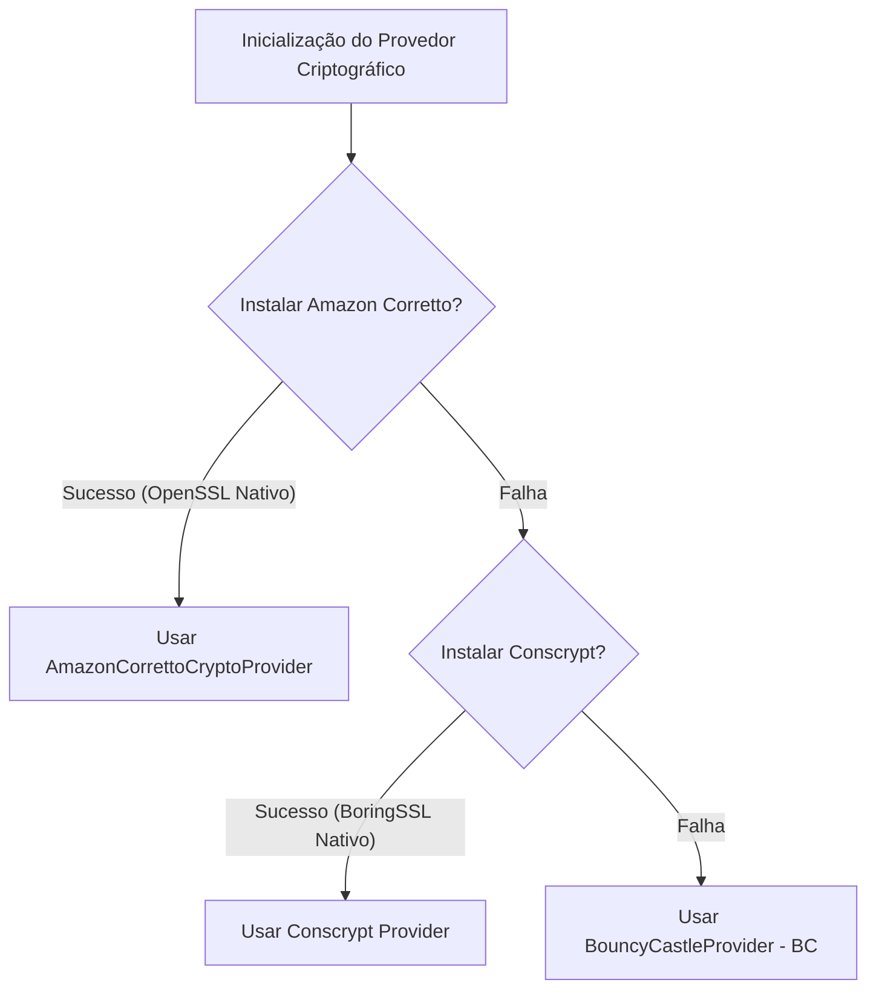

# 🛡️ Criptografia e Segurança da Blockchain AMZX (Rigor Técnico)

Este documento detalha exaustivamente a arquitetura criptográfica do nó da blockchain **AMZX (better2better.com.br)**. Ele descreve as primitivas criptográficas adotadas, como cada algoritmo é utilizado no protocolo, sua finalidade, as bibliotecas subjacentes que realizam as operações e uma análise crítica de obsolescência, segurança e possíveis melhorias futuras.

---

## 🗺️ Mapa Geral da Criptografia da Blockchain AMZX

A blockchain AMZX adota uma abordagem híbrida e moderna para garantir integridade, autenticidade, consenso e privacidade. A tabela abaixo resume o catálogo mestre de todas as primitivas utilizadas no nó:

| Primitiva | Tipo de Algoritmo | Biblioteca / Provedor Java | Onde é Usada na AMZX | Estado de Segurança | Substituição Recomendada? |
| :--- | :--- | :--- | :--- | :--- | :--- |
| **Curve25519 (Ed25519)** | Curva Elíptica (Assinatura) | `com.wavesplatform.curve25519-java` (0.6.6) | Assinaturas de contas, transações standard, blocos, funções de contratos inteligentes (`sigVerify`). | **Segura** (Com mitigação ativa de chaves fracas). | Não no curto prazo, mas sim migrar para bindings nativas em Rust/libsodium no longo prazo. |
| **secp256k1** | Curva Elíptica (Assinatura) | `org.web3j:crypto` (4.13.0) + BouncyCastle | Compatibilidade Ethereum (EVM-RPC), carteiras MetaMask e transações do tipo `EthereumTransaction`. | **Segura** (Padrão de mercado para Bitcoin/Ethereum). | Não. Crucial para interoperabilidade. |
| **BLS12-381** | Curva de Emparelhamento | `supranational.blst` (`blst-java` 0.3.15-1) | Assinaturas agregadas e multifuncionais avanzadas, provas de conhecimento zero (zk-SNARKs). | **Excelente** (Estado da arte, alto desempenho e segurança). | Absolutamente não. É a curva mais moderna disponível. |
| **Blake2b-256** | Função de Hash | BouncyCastle (`Blake2bDigest`) | Geração rápida de índices internos, hash de cabeçalhos temporários, primeiro nível de hashing seguro. | **Altamente Segura** e ultra veloz. | Não. Perfeita para sistemas de alto tráfego. |
| **Keccak-256** | Função de Hash | BouncyCastle (`KeccakDigest`) | Geração de endereços (duplo hash), assinaturas de transações e transações Ethereum (`EthereumTransaction`). | **Excelente** (Padrão Ethereum). | Não. Garante integridade absoluta de transações e contas. |
| **SHA-256** | Função de Hash | `java.security.MessageDigest` (via ACCP/Conscrypt) | Hashing de sementes secretas (Seed), derivador de chaves de API (`api-key-hash`) e salt BLS. | **Totalmente Segura**. | Não. Algoritmo padrão da indústria de segurança global. |

---

## 🚀 Provedores Criptográficos Dinâmicos (JVM Engine)

Um dos pontos mais fortes do nó AMZX é a sua **máquina de provedores criptográficos dinâmicos**, implementada em `com.wavesplatform.crypto.Provider.scala`. Em vez de depender cegamente de um único provedor padrão da máquina virtual Java (que pode ser lento ou conter vulnerabilidades), a blockchain tenta carregar de forma oportunista os provedores mais rápidos e seguros do mundo:



### Detalhes de Implementação:
1. **Amazon Corretto Crypto Provider (ACCP)**: É a primeira escolha do nó (`AmazonCorrettoCryptoProvider.install()`). Se o ambiente JVM for executado em hardware compatível com Linux ou MacOS (x86_64 ou Aarch64), ele carrega bindings nativas em C do OpenSSL. Isso acelera drasticamente operações de assinatura e hashing (por exemplo, SHA256 com aceleração por hardware SHA-NI e AES-NI).
2. **Conscrypt (BoringSSL)**: Caso o ACCP falhe, o nó tenta carregar o provedor `Conscrypt.newProvider()`, desenvolvido pela Google e baseado no BoringSSL. Ele também fornece altíssima performance por meio de código nativo compilado.
3. **Bouncy Castle (BC)**: Se nenhum dos provedores nativos estiver disponível, o sistema recorre ao `BouncyCastleProvider` em Java puro. É extremamente confiável sob a perspectiva criptográfica, mas é executado inteiramente na JVM, o que causa um overhead de CPU ligeiramente maior comparado aos provedores nativos.

---

## 🛡️ Mitigação de Chaves Elípticas Fracas (Curve25519 Blacklist)

A Curve25519 é uma curva elíptica incrivelmente segura e resistente a ataques de temporização e canais colaterais. No entanto, ela possui alguns pontos de ordem extremamente baixa no subgrupo (pontos com ordens 1, 2, 4 e 8). Se um usuário ou invasor malicioso gerar transações ou provas de consenso usando essas chaves públicas fracas, é matematicamente possível falsificar assinaturas ou contornar as validações sem possuir a chave privada correspondente.

Para evitar ataques de subgrupo pequeno (*small-subgroup attacks*), o nó AMZX implementa uma proteção ativa e severa em `com.wavesplatform.crypto.package.scala`:

### Lista Negra de Chaves Públicas Fracas
O nó rejeita explicitamente qualquer operação de verificação contendo chaves públicas correspondentes às constantes matemáticas conhecidas de ordem baixa:

```scala
private val BlacklistedKeys: Array[Array[Byte]] = Array(
  // 0 (order 4)
  Array(0x00, 0x00, 0x00, ...),
  // 1 (order 1)
  Array(0x01, 0x00, 0x00, ...),
  // 325606250916557431795983626356110631294008115727848805560023387167927233504 (order 8)
  Array(0xe0, 0xeb, 0x7a, ...),
  // 39382357235489614581723060781553021112529911719440698176882885853963445705823 (order 8)
  Array(0x5f, 0x9c, 0x95, ...),
  // p-1 (order 2)
  Array(0xec, 0xff, 0xff, ...),
  // p (=0, order 4)
  Array(0xed, 0xff, 0xff, ...),
  // p+1 (=1, order 1)
  Array(0xee, 0xff, 0xff, ...)
)
```

E realiza a verificação de chaves na rotina `isWeakPublicKey`:

```scala
def isWeakPublicKey(publicKey: Array[Byte]): Boolean =
  BlacklistedKeys.exists { wk =>
    publicKey.view.init.iterator.sameElements(wk.view.init) &&
    (publicKey.last == wk.last || (publicKey.last & 0xff) == wk.last + 0x80)
  }
```

Qualquer tentativa de enviar uma transação ou validar um bloco gerado por meio dessas chaves fracas resulta em falha imediata da transação ou rejeição do bloco, anulando completamente esse vetor de ataque no nó da blockchain.

---

## ⚡ Detalhamento Técnico das Primitivas Criptográficas

### 1. Duplo Esquema de Hashing (`secureHash`)
Em sistemas de ledger tradicionais (como Bitcoin), aplica-se hashing duplo do mesmo algoritmo (por exemplo, `SHA256(SHA256(data))`). Na AMZX, adotamos uma estratégia mais moderna e segura contra ataques de extensão de comprimento (*length-extension attacks*) e colisões, mesclando duas das funções de hashing mais robustas disponíveis:

$$\text{secureHash}(data) = \text{Keccak256}(\text{Blake2b-256}(data))$$

*   **Fase 1 (`Blake2b-256`)**: É executado primeiro por sua altíssima eficiência em CPU 64-bit (muito mais veloz que SHA-3 ou SHA-256). Ele compacta e gera uma digest inicial de 32 bytes.
*   **Fase 2 (`Keccak-256`)**: A digest da fase 1 é passada pelo algoritmo Keccak-256 (padrão SHA-3 original usado no Ethereum). Keccak possui uma estrutura interna de esponja que impossibilita ataques de extensão e garante uma dispersão pseudoaleatória excelente.

**Onde é usado**: Geração do endereço de 26 bytes do usuário, identificadores únicos de blocos, hashes de transações pendentes no UTX, e na validação interna de dApps.

### 2. Funções Verificáveis de Aleatoriedade (VRF)
No consenso de staking FairPoS, um nó minerador não pode simplesmente prever quando ele ganhará o próximo "hit" para cunhar um bloco (o que permitiria ataques de moagem de stake, ou *Stake-Grinding*). Para atingir aleatoriedade justa e criptograficamente verificável, a AMZX emprega as **Verifiable Random Functions (VRF)** com base em curvas elípticas Curve25519.

*   O nó validador assina deterministicamente a digest do bloco anterior combinada com a sua chave privada:
    $$\text{VRFSignature} = \text{calculateVrfSignature}(\text{randomSeed}, \text{privateKey}, \text{blockDigest})$$
*   Qualquer outro nó da rede consegue verificar se a assinatura VRF gerada corresponde exatamente à chave pública do validador e que o valor resultante é verdadeiramente pseudoaleatório, sem que o validador tenha tido a oportunidade de tentar infinitas variações para trapacear o algoritmo do consenso.

---

## 🔬 Auditoria de Segurança e Análise Crítica (Blockchain)

### 1. Desempenho e Versão da Biblioteca Curve25519
*   **Problema**: O nó utiliza a biblioteca `com.wavesplatform.curve25519-java` em sua versão `0.6.6`. Essa biblioteca é mantida como um fork privado e contém trechos antigos da biblioteca Signal WhisperSystems. Embora não existam falhas graves conhecidas nessa versão, o empacotamento JAR contém código nativo para plataformas legadas e não é atualizado frequentemente.
*   **Se deve trocar**: Não imediatamente em produção, pois funciona perfeitamente devido à mitigação ativa de chaves fracas. Mas no médio/longo prazo, é altamente recomendado substituir essa biblioteca por bindings nativas diretas utilizando **libsodium** (via JNI ou JNA) ou uma implementação moderna escrita em Rust com chamadas FFI altamente otimizadas.
*   **Por que não trocar correndo?**: Mudar a implementação da curva Curve25519 pode introduzir sutis diferenças na serialização ou no tratamento de assinaturas elípticas que poderiam forçar um **hard fork** acidental na rede se um nó de versão antiga interpretar assinaturas ligeiramente diferente dos nós de versão nova.

### 2. Dependência de BouncyCastle
*   **Problema**: Depender fortemente do Bouncy Castle para operações críticas (como hashing Keccak256 e Blake2b256 quando ACCP ou Conscrypt falham) pode gerar gargalos se a máquina hospedeira possuir baixa potência de processamento.
*   **Recomendação**: Sempre assegurar que as dependências nativas do **Amazon Corretto Crypto Provider (ACCP)** estejam totalmente compiladas para a arquitetura do servidor de produção. Isso garante que a aceleração por hardware impeça ataques de negação de serviço por exaustão de CPU durante rajadas massivas de transações.

---

## 📋 Conclusão da Criptografia da Blockchain
A blockchain AMZX possui uma blindagem criptográfica exemplar no nó:
1. Tem proteção ativa contra chaves de ordem baixa elíptica (Curve25519).
2. Faz dupla passagem de hashing Keccak-Blake2b, garantindo imunidade a ataques modernos de colisão.
3. Possui assinaturas BLS12-381 nativas integradas para agregação de alta escala de transações e dApps complexos.
4. Tem suporte a assinaturas secp256k1 baseadas no ecossistema Ethereum, trazendo total segurança a carteiras Web3 (MetaMask).

No entanto, o maior perigo de segurança e o elo mais fraco da criptografia atual não reside no nó principal, mas sim nas **discrepâncias de implementação com o Matcher DEX**, conforme detalhado no documento subsequente.
