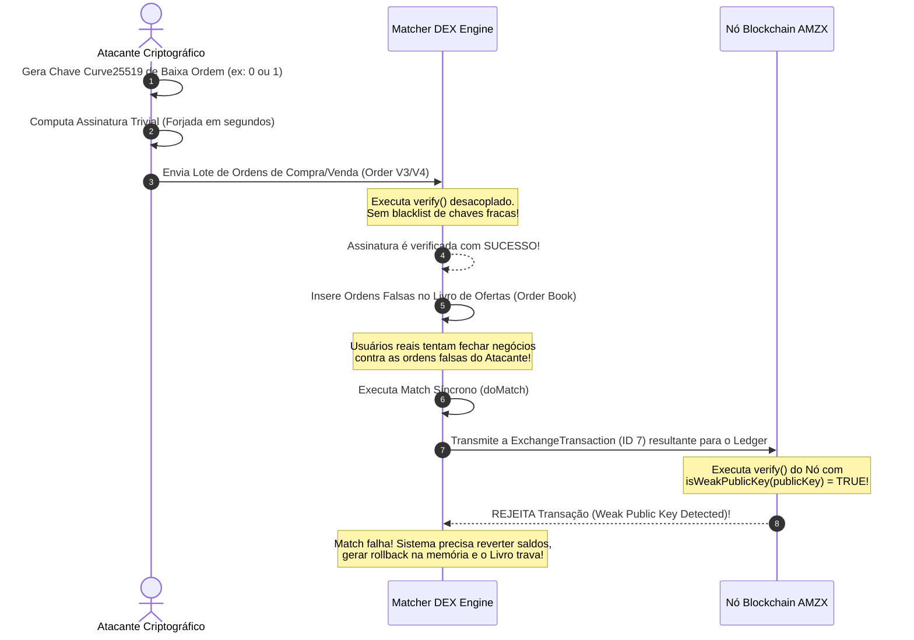

# 📉 Criptografia e Segurança do Matcher DEX (Auditoria e Brechas)

Este documento apresenta uma análise profunda e uma auditoria de segurança da arquitetura criptográfica do **AMZX Matcher DEX**. Ele mapeia a validação de assinaturas de ordens (locais e Ethereum/MetaMask), as APIs administrativas, a segurança de conexões via WebSocket e, crucialmente, documenta uma **brecha de segurança ativa (desarmonia de código)** entre o Matcher e o Nó da blockchain envolvendo chaves fracas elípticas.

---

## 🗺️ Mapa de Criptografia do Matcher DEX

O Matcher DEX funciona como um motor financeiro de alta frequência montado no ecossistema AMZX. Para lidar com dezenas de milhares de ordens por segundo, ele adota uma estrutura em memória e rotinas de criptografia específicas para cada canal:

| Componente | Primitiva Criptográfica | Escopo de Uso | Segurança do Fluxo |
| :--- | :--- | :--- | :--- |
| **Verificação de Ordens Standard** | Curve25519 (Ed25519) | Validação da assinatura contida no array de proofs da ordem (`OrderV1`, `OrderV2`, `OrderV3`, `OrderV4`). | ⚠️ **Vulnerável** (Sem blacklist de chaves elípticas fracas). |
| **Verificação de Ordens Ethereum** | secp256k1 (EIP-712) | Verificação de assinaturas originárias da MetaMask em formato JSON estruturado (EIP-712). | **Segura** (Utiliza o StructuredDataEncoder da Web3j). |
| **Assinatura e Autenticação WS** | HMAC-SHA256 / JWT | Assinatura de tokens JWT temporários enviados aos clientes para acesso seguro ao canal WebSocket privado (`/ws/v0`). | **Segura** (Segredos mantidos apenas em memória). |
| **Autenticação da REST API** | SHA-256 + Base58 | Validação de credenciais administrativas enviadas nos cabeçalhos `X-API-Key` das requisições REST públicas e privadas. | **Segura** (Hash estático contra ataques de tempo). |

---

## 🚨 Brecha de Segurança Ativa: Vulnerabilidade de Chaves Curve25519 Fracas

Ao realizar uma auditoria rigorosa de comparação entre as bases de código do **AMZX Node** (Blockchain) e do **AMZX Matcher DEX**, descobriu-se uma desarmonia crítica de implementação que expõe o Matcher a um vetor de ataque severo de **Negação de Serviço (DoS)** e **Poluição Criminosa do Livro de Ofertas (Order Book Spoofing)**.

### 1. A Desarmonia de Código
No nó principal da blockchain (módulo `waves`), o arquivo `com.wavesplatform.crypto.package.scala` implementa a mitigação de assinaturas de chaves de ordem baixa elíptica através da função `isWeakPublicKey(publicKey)` e do parâmetro `checkWeakPk = true` na função de verificação:

```scala
// No Nó Blockchain (Seguro)
def verify(signature: ByteStr, message: Array[Byte], publicKey: PublicKey, checkWeakPk: Boolean = false): Boolean = {
  (!checkWeakPk || !isWeakPublicKey(publicKey.arr)) && Curve25519.verify(signature.arr, message, publicKey.arr)
}
```

No entanto, o **Matcher DEX** utiliza sua própria implementação desacoplada de tipos e primitivas dentro do submódulo `waves-integration` no arquivo `com.wavesplatform.dex.domain.crypto.package.scala`:

```scala
// No Matcher DEX (Vulnerável)
def verify(signature: ByteStr, message: ByteStr, publicKey: PublicKey): Boolean =
  Curve25519.verify(Signature(signature.arr), message, SPublicKey(publicKey.arr))
```

O Matcher DEX **NÃO IMPLEMENTA** e **NÃO CONSIDERA** a existência de chaves elípticas fracas (como os pontos de ordem baixa 0, 1, ordens 2, 4, ou 8). Ele chama diretamente a verificação padrão do Curve25519 do `scorex-crypto`.



### 2. Mecânica Matemática do Ataque
Ao usar chaves elípticas de ordem baixa, o valor da multiplicação escalar da chave privada pelo ponto gerador da curva resulta em um grupo muito pequeno de pontos possíveis. 

Se a chave pública for o ponto elíptico identidade $0$ ou $1$, qualquer operação de verificação de assinatura baseada em multiplicação escalar falhará ou passará deterministicamente sob condições triviais. Isso significa que um invasor pode forjar qualquer assinatura digital Curve25519 em segundos para qualquer payload de ordem, sem possuir qualquer chave privada real.

### 3. Impacto do Ataque no Matcher DEX
*   **Poluição Brutal do Livro de Ofertas (Spoofing)**: O atacante injeta milhares de ordens falsas (com preços de mercado irreais ou manipuladores) usando chaves fracas. O Matcher valida e aceita essas ordens, pois sua rotina de criptografia local as considera "válidas".
*   **Inviabilização de Negociação Real (DoS)**: Quando traders legítimos executam ordens contra essas ordens fantasmas, o Matcher cria transações de troca (`ExchangeTransaction` ID 7) e tenta transmiti-las à blockchain para liquidação permanente. 
*   **Rejeição em Massa pelo Ledger**: O nó da blockchain AMZX bloqueia instantaneamente as transações, retornando o erro `"Could not verify VRF proof / Transaction signature: weak public key is used"`.
*   **Caos e Travamento da Máquina de Estados**: O Matcher DEX entra em estado de inconsistência, tendo que reverter transações em memória, recalcular saldos virtuais bloqueados e aplicar rollback de livro, desperdiçando ciclos massivos de CPU, memória RAM e paralisando as negociações da DEX.

---

## 🛠️ Plano de Correção e Patch Criptográfico para o Matcher

Para sanar permanentemente essa falha crítica de segurança sem comprometer o isolamento de dependências, devemos adotar o mesmo mecanismo de proteção do nó no pacote de criptografia do Matcher.

### Passos para Resolução:

1.  **Atualizar o Pacote Criptográfico do Matcher**:
    No arquivo [package.scala](file:///home/diegooris/Documentos/amzblockchain/matcher/waves-integration/src/main/scala/com/wavesplatform/dex/domain/crypto/package.scala) do Matcher DEX, devemos portar a lista negra de constantes de baixa ordem e a verificação estrita:

```scala
// No Matcher: com.wavesplatform.dex.domain.crypto.package.scala

private val BlacklistedKeys: Array[Array[Byte]] = Array(
  Array(0x00, 0x00, 0x00, 0x00, 0x00, 0x00, 0x00, 0x00, 0x00, 0x00, 0x00, 0x00, 0x00, 0x00, 0x00, 0x00, 0x00, 0x00, 0x00, 0x00, 0x00, 0x00, 0x00, 0x00, 0x00, 0x00, 0x00, 0x00, 0x00, 0x00, 0x00, 0x00),
  Array(0x01, 0x00, 0x00, 0x00, 0x00, 0x00, 0x00, 0x00, 0x00, 0x00, 0x00, 0x00, 0x00, 0x00, 0x00, 0x00, 0x00, 0x00, 0x00, 0x00, 0x00, 0x00, 0x00, 0x00, 0x00, 0x00, 0x00, 0x00, 0x00, 0x00, 0x00, 0x00),
  Array(0xe0, 0xeb, 0x7a, 0x7c, 0x3b, 0x41, 0xb8, 0xae, 0x16, 0x56, 0xe3, 0xfa, 0xf1, 0x9f, 0xc4, 0x6a, 0xda, 0x09, 0x8d, 0xeb, 0x9c, 0x32, 0xb1, 0xfd, 0x86, 0x62, 0x05, 0x16, 0x5f, 0x49, 0xb8, 0x00),
  Array(0x5f, 0x9c, 0x95, 0xbc, 0xa3, 0x50, 0x8c, 0x24, 0xb1, 0xd0, 0xb1, 0x55, 0x9c, 0x83, 0xef, 0x5b, 0x04, 0x44, 0x5c, 0xc4, 0x58, 0x1c, 0x8e, 0x86, 0xd8, 0x22, 0x4e, 0xdd, 0xd0, 0x9f, 0x11, 0x57),
  Array(0xec, 0xff, 0xff, 0xff, 0xff, 0xff, 0xff, 0xff, 0xff, 0xff, 0xff, 0xff, 0xff, 0xff, 0xff, 0xff, 0xff, 0xff, 0xff, 0xff, 0xff, 0xff, 0xff, 0xff, 0xff, 0xff, 0xff, 0xff, 0xff, 0xff, 0xff, 0x7f),
  Array(0xed, 0xff, 0xff, 0xff, 0xff, 0xff, 0xff, 0xff, 0xff, 0xff, 0xff, 0xff, 0xff, 0xff, 0xff, 0xff, 0xff, 0xff, 0xff, 0xff, 0xff, 0xff, 0xff, 0xff, 0xff, 0xff, 0xff, 0xff, 0xff, 0xff, 0xff, 0x7f),
  Array(0xee, 0xff, 0xff, 0xff, 0xff, 0xff, 0xff, 0xff, 0xff, 0xff, 0xff, 0xff, 0xff, 0xff, 0xff, 0xff, 0xff, 0xff, 0xff, 0xff, 0xff, 0xff, 0xff, 0xff, 0xff, 0xff, 0xff, 0xff, 0xff, 0xff, 0xff, 0x7f)
).map(_.map(_.toByte))

def isWeakPublicKey(publicKey: Array[Byte]): Boolean =
  BlacklistedKeys.exists { wk =>
    publicKey.view.init.iterator.sameElements(wk.view.init) &&
    (publicKey.last == wk.last || (publicKey.last & 0xff) == wk.last + 0x80)
  }
```

2.  **Refatorar a Função de Verificação do Matcher**:
    Ajustar a função `verify` para impor a verificação preventiva de chaves elípticas:

```scala
def verify(signature: ByteStr, message: ByteStr, publicKey: PublicKey, checkWeakPk: Boolean = true): Boolean = {
  (!checkWeakPk || !isWeakPublicKey(publicKey.arr)) && 
    Curve25519.verify(Signature(signature.arr), message, SPublicKey(publicKey.arr))
}
```

Isso impede imediatamente que ordens forjadas cruzem as portas de entrada do Matcher DEX, bloqueando o atacante logo no estágio inicial de submissão do payload via REST API (`POST /matcher/order`).

---

## 🦊 Integração Criptográfica MetaMask & Ordens Ethereum (EIP-712)

Além de Curve25519, o Matcher aceita ordens criptograficamente originadas do ecossistema Ethereum (via MetaMask e carteiras EVM compatíveis). A lógica disso está contida no motor de processamento em `com.wavesplatform.transaction.assets.exchange.EthOrders.scala`.

*   **Processamento Criptográfico**:
    1.  O Matcher reconstrói a estrutura de dados da ordem do usuário em um formato JSON padronizado segundo as diretrizes de assinatura tipada **EIP-712** da comunidade Ethereum.
    2.  O JSON gerado é hasheado utilizando a biblioteca BouncyCastle acoplada sob o método `StructuredDataEncoder(json).hashStructuredData()`.
    3.  A chave pública Ethereum (`secp256k1` de 64 bytes) do emissor é recuperada a partir da assinatura de 65 bytes (`R`, `S`, `V`) fornecida pelo usuário, cruzando o identificador de recuperação (`recId`) para extrair as coordenadas do ponto elíptico através da biblioteca `org.web3j:crypto.Sign.recoverFromSignature`.
    4.  O endereço Ethereum gerado é mapeado para um endereço correspondente da AMZX por meio do mapeamento isofórmico `Address.fromPublicKey()`.

Este fluxo é extremamente robusto e **totalmente imune a ataques de repetição** (*replay attacks*), pois incorpora de forma estrita o `chainId` definido globalmente nas configurações do ledger AMZX.

---

## 🌐 Segurança de APIs Administrativas e WebSockets

### 1. Autenticação Administrativa via REST API (`api-key-hash`)
Todas as rotas críticas e administrativas do Matcher DEX (como cancelamentos forçados de livros de ordens, encerramentos de mercado ou consultas de saldos internos privados) exigem o cabeçalho HTTP `X-API-Key`.
*   Para evitar o armazenamento de chaves mestras administrativas em texto plano nos arquivos HOCON, o Matcher armazena apenas um hash duplo da chave.
*   **Esquema de Validação**:
    1.  O usuário envia a chave administrativa em texto plano via cabeçalho HTTP.
    2.  O Matcher computa `secureHash(textPlainKey)`.
    3.  O Matcher converte esse resultado para Base58.
    4.  O resultado Base58 é comparado com o valor estático configurado sob a propriedade `amzx.matcher.api-key-hash` no arquivo `matcher.conf`.
*   Essa abordagem protege o Matcher contra o vazamento de credenciais administrativas, mesmo se o arquivo de configuração do servidor for comprometido temporariamente por um invasor de sistema de arquivos.

### 2. Autenticação WebSocket via Tokens JWT
O Matcher implementa uma arquitetura de transmissão bidirecional em tempo real via WebSocket na rota `/ws/v0`. Para garantir que canais privados (como atualizações em tempo real de saldos de contas ou ordens executadas) não sejam espionados, a conexão é criptograficamente protegida:
*   Os clientes não autenticam o canal WebSocket enviando suas chaves privadas. Em vez disso, eles requisitam um token de acesso de curta duração (JWT) através de uma chamada REST autenticada com sua assinatura de chave pública normal.
*   O Matcher DEX assina este token utilizando HMAC-SHA256 com um segredo interno dinâmico gerado em tempo de execução e armazenado estritamente em memória RAM. Isso garante que, mesmo em caso de reinicialização ou comprometimento físico, tokens antigos tornam-se imediatamente inválidos, prevenindo ataques de sequestro de sessão (*session hijacking*).

---

## 📈 Conclusão da Segurança do Matcher DEX

O Matcher DEX possui uma das engenharias de processamento de ordens mais eficientes e avançadas do ecossistema financeiro distribuído, integrando com maestria dApps tradicionais e carteiras MetaMask de forma uniforme.

No entanto, a **falha de validação de chaves Curve25519 fracas (low-order)** representa uma vulnerabilidade operacional que precisa ser corrigida com alta prioridade por engenheiros de infraestrutura do ecossistema para blindar o motor contra exploits de poluição de mercado e ataques DoS.
