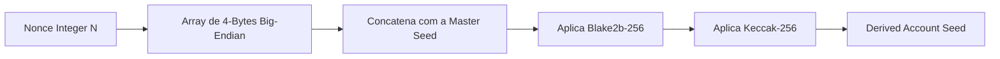

# 📖 Manual Operacional e de Desenvolvimento AMZX (Guia Definitivo)

Este manual técnico exaustivo foi elaborado para engenheiros de blockchain, operadores de nós, validadores e desenvolvedores do ecossistema **AMZX (better2better.com.br)**. Ele descreve passo a passo todos os fluxos operacionais necessários para interagir, implantar e customizar o ecossistema utilizando os pacotes e códigos compilados do Nó e do Matcher DEX.

---

## 🗺️ Índice de Fluxos do Manual

1.  **🚀 Como Iniciar um Nó da Blockchain (Node Operator)**
2.  **⛓️ Como se Tornar um Validador (Miner) e Ganhar Rewards**
3.  **🛠️ Como Criar uma Blockchain Customizada (Custom Blockchain Generator)**
4.  **📈 Como Configurar, Iniciar e Acoplar o Matcher DEX**
5.  **🪪 Como Derivar Múltiplos Endereços a Partir de uma Única Seed**
6.  **🏦 Manual de Leasing (Arrendamento) e Retirada de Fundos**
7.  **💸 Fluxo e Distribuição de Rewards de Staking (LPoS/FairPoS)**
8.  **🛡️ Práticas Recomendadas de Segurança e Hardening de Servidores**

---

## 🚀 1. Como Iniciar um Nó da Blockchain (Node Operator)

Para operar um nó AMZX, o operador precisa compilar o código Scala da blockchain, gerar o pacote executável (JAR) e configurar o ambiente HOCON.

### Passo 1: Compilação e Empacotamento
A partir da raiz do repositório `/home/diegooris/Documentos/amzblockchain/waves`, execute os comandos SBT para gerar o pacote consolidado de distribuição:

```bash
# Executa testes integrados e compila todos os módulos
sbt packageAll
```
Isso gerará o arquivo JAR consolidado na pasta `node/target/universal/` (por exemplo, `amzx-node-all.jar` ou similar).

### Passo 2: Estrutura de Diretórios Recomendada
Crie uma pasta operacional estruturada em seu servidor de produção:

```bash
sudo mkdir -p /var/lib/amzx-node/{data,log,wallet}
sudo chown -R $USER:$USER /var/lib/amzx-node
```

### Passo 3: Criação do Arquivo de Configuração (`amzx.conf`)
Crie o arquivo `/var/lib/amzx-node/amzx.conf` contendo as configurações mínimas para se conectar à rede:

```hocon
amzx {
  # Diretório de armazenamento (RocksDB e Wallets)
  directory = "/var/lib/amzx-node"
  
  # Configuração de rede P2P
  network {
    bind-address = "0.0.0.0"
    port = 6868
    node-name = "AMZX-Amazon-Node-01"
    declared-address = "SEU_IP_PUBLICO:6868"
    
    # Identificador da Rede: 'A' para Amazonic Mainnet, 'T' para Testnet
    charset = "UTF-8"
    address-scheme-character = "A"
    
    # Lista de nós para sincronização inicial (Seed Nodes)
    known-peers = [
      "13.59.100.22:6868",
      "52.14.150.11:6868"
    ]
  }

  # Configurações de carteira local do nó
  wallet {
    file = "/var/lib/amzx-node/wallet/wallet.dat"
    password = "SUA_SENHA_FORTE_PARA_CRIPTOGRAFAR_CARTEIRA_LOCAL"
    # Seed secreta opcional em texto plano no arquivo (Não recomendado em Produção!)
    # seed = "base58_encoded_secret_seed"
  }

  # Configuração da REST API Administrativa/Pública
  rest-api {
    enable = yes
    bind-address = "0.0.0.0"
    port = 6869
    # Hash duplo SHA-256 Base58 de uma senha administrativa forte (ex: "admin_secret")
    api-key-hash = "6Y39p8G7Nsm2CFrfUqZWhB8M2qE2HqZ3kM7rWzVb8C7A"
  }
}
```

### Passo 4: Execução do Serviço
Inicie o nó chamando a Java Virtual Machine (JVM) com as configurações otimizadas de memória:

```bash
java -Xms4g -Xmx4g \
     -XX:+UseG1GC \
     -Dlogback.configurationFile=/var/lib/amzx-node/logback.xml \
     -jar /var/lib/amzx-node/amzx-node.jar \
     /var/lib/amzx-node/amzx.conf
```

---

## ⛓️ 2. Como se Tornar um Validador (Miner) e Ganhar Rewards

Validadores no mecanismo LPoS (Leased Proof of Stake) cravam blocos baseando-se no seu peso de stake (saldo próprio somado aos saldos arrendados).

### Passo 1: Requisitos de Stake Mínimo
*   **Stake de Geração**: Para ser elegível a gerar blocos na blockchain AMZX, o endereço validador precisa ter um stake gerador efetivo mínimo de **1000 AMZX** (seja saldo próprio livre ou recebido via Leasing de outros usuários) ativo nos últimos **1000 blocos**.

### Passo 2: Configuração de Validador no HOCON
Insira a seção `miner` no seu arquivo `amzx.conf` para instruir o nó a minerar ativamente:

```hocon
amzx {
  # Ativação do motor de consenso e mineração
  miner {
    enable = yes
    
    # Quórum de peers online mínimos para permitir mineração.
    # Em redes públicas, deve ser pelo menos 1 ou 2. Em redes privadas de teste, use 0.
    quorum = 1
    
    # Tempo limite para aguardar sincronia de rede antes de minerar
    interval-after-last-block-then-generation-is-allowed = 120s
    no-quorum-mining-delay = 15s
    
    # Intervalo de emissão de micro-blocos Waves-NG
    micro-block-interval = 5s
    max-transactions-in-micro-block = 500
    
    # Chaves privadas autorizadas a minerar diretamente associadas ao nó (Base58)
    private-keys = [
      "5Y2m6E1RzVb8M2qE2HqZ3kM7rWzVb8C7A5Y2m6E1RzVb"
    ]
  }
}
```

### Passo 3: Fluxo de Inicialização de Mineração
1.  **Desbloqueio via REST API**: Caso você não coloque a chave privada estaticamente nas configurações (altamente recomendado por segurança), você deve desbloquear a carteira via REST API do nó após a inicialização:
    ```bash
    curl -X POST "http://localhost:6869/wallet/unlock" \
         -H "X-API-Key: admin_secret" \
         -H "Content-Type: application/json" \
         -d '"SUA_SENHA_FORTE_PARA_CRIPTOGRAFAR_CARTEIRA_LOCAL"'
    ```
2.  **Confirmação de Status**: Acesse o endpoint de mineração para verificar se o nó está ativamente minerando:
    ```bash
    curl -X GET "http://localhost:6869/miner/status" -H "X-API-Key: admin_secret"
    ```
    *Retorno esperado:* `{"status": "mining"}` ou `{"status": "idle", "reason": "Wait for 1000 blocks to activate generating balance"}`.

---

## 🛠️ 3. Como Criar uma Blockchain Customizada (Custom Blockchain)

Se você deseja iniciar uma rede de blocos totalmente nova, independente e soberana (como a rede local Amazonic Testnet ou uma rede corporativa), deve parametrizar um novo bloco gênesis e um Chain ID exclusivo.

### Passo 1: Modificar o Address Scheme (Magic Byte)
Cada rede da AMZX possui uma assinatura de endereço exclusiva baseada em um único caractere (Magic Byte). 
*   **Modificação de Código**: No código-fonte Scala, altere o Chain ID padrão para o caractere de sua escolha em `AddressScheme.scala` (ou configure no HOCON):
    ```scala
    // waves/node/src/main/scala/com/wavesplatform/account/AddressScheme.scala
    package com.wavesplatform.account
    
    case class AddressScheme(chainId: Byte)
    object AddressScheme {
      // Define o valor padrão para a nova blockchain customizada
      var current: AddressScheme = AddressScheme('C'.toByte) // 'C' para Custom
    }
    ```

### Passo 2: Geração de Contas Gênesis (Rich Accounts)
Gere uma conta mestra que deterá todos os tokens criados no bloco de gênese:
1.  Gere um par de chaves usando o utilitário offline ou REST API:
    *   **Seed**: `"jungle timber core abstract virtual dynamic forest unique matrix custom elite gold bullet"`
    *   **Chave Pública**: `5Y2m6E1RzVb8M2qE2HqZ3...`
    *   **Endereço**: `3MyWzVb8C7A5Y2m6E1Rz...`

### Passo 3: Criação das Configurações de Gênesis (`genesis.conf`)
Gere a parametrização do bloco número 1 (Gênesis) especificando a distribuição inicial de saldos (Transactions ID 1):

```hocon
genesis {
  # Horário do Unix timestamp de nascimento da blockchain
  block-timestamp = 1779999999000
  
  # Assinatura geradora do bloco mestre (Gênesis)
  signature = "5Y2m6E1RzVb8M2qE2HqZ3kM7rWzVb8C7A5Y2m6E1RzVb8C7A5Y2m6E1RzVb8C7A5Y"
  
  # Distribuição inicial de tokens (100 milhões de tokens AMZX)
  initial-balance = 10000000000000000
  
  # Lista de transações gênesis (ID 1)
  transactions = [
    {
      recipient = "3MyWzVb8C7A5Y2m6E1RzVb8C7A5Y2m6E1Rz"
      amount = 10000000000000000
    }
  ]
  
  # Ativação imediata de consensos e recursos na blockchain
  pre-activated-features {
    1 = 0   # Smart Accounts
    2 = 0   # Smart Assets
    3 = 0   # Waves-NG Consenso
    15 = 0  # Ride V6 e Compatibilidade Ethereum
  }
}
```

### Passo 4: Geração de Assinatura de Gênesis Automatizada
O Nó AMZX fornece uma classe de geração rápida de assinaturas chamada `com.wavesplatform.utils.GenesisBlockGenerator`.
A partir do terminal de desenvolvimento, você pode construir e imprimir os parâmetros de bloco gerados de forma matemática:

```bash
sbt "node/runMain com.wavesplatform.utils.GenesisBlockGenerator /var/lib/amzx-node/genesis.conf"
```
Esse comando retornará as propriedades calculadas da assinatura de gênese (`signature` e `transactions` assinadas byte-a-byte), prontas para serem inseridas no arquivo definitivo `application.conf` ou `custom.conf` da nova rede.

---

## 📈 4. Como Configurar, Iniciar e Acoplar o Matcher DEX

O Matcher DEX não roda isoladamente; ele se acopla ao nó da blockchain através de uma interface de rede direta (gRPC de alta performance) e uma extensão nativa chamada `DEXExtension`.

### Passo 1: Configuração do Acoplamento do Nó (`amzx.conf`)
Insira as configurações de extensão gRPC no nó da blockchain para expor os fluxos de blocos em tempo real ao Matcher:

```hocon
amzx {
  # Ativa a extensão de integração de dados do Matcher
  extensions = [
    "com.wavesplatform.dex.grpc.integration.DEXExtension"
  ]
  
  # Porta gRPC dedicada do nó
  grpc {
    enable = yes
    bind-address = "127.0.0.1"
    port = 6870
  }
}
```

### Passo 2: Configuração do Matcher DEX (`matcher.conf`)
O arquivo `/var/lib/amzx-node/matcher.conf` contém a parametrização do motor financeiro da DEX:

```hocon
amzx.matcher {
  # Endereço e Porta da REST API pública do Matcher
  bind-address = "0.0.0.0"
  port = 6886
  
  # Conexão gRPC com o Nó da Blockchain
  grpc-integration {
    target = "127.0.0.1:6870"
  }
  
  # Chave pública oficial do Matcher (Para verificação de taxas)
  matcher-public-key = "5Y2m6E1RzVb8M2qE2HqZ3kM7rWzVb8C7A5Y2m6E1Rz"
  
  # Configuração de taxas de correspondência (Order Fee Settings)
  order-fee {
    mode = "dynamic"
    dynamic {
      max-base-fee = 300000 # 0.003 AMZX em satoshis
    }
  }

  # Versões de ordens autorizadas
  allowed-order-versions = [1, 2, 3, 4]
}
```

### Passo 3: Inicialização do Matcher DEX
Inicie o motor financeiro do Matcher referenciando o arquivo de propriedades:

```bash
java -Xms4g -Xmx4g \
     -jar /var/lib/amzx-node/amzx-matcher.jar \
     /var/lib/amzx-node/matcher.conf
```
*Fluxo de inicialização bem-sucedido:* O Matcher lê o estado acumulado da blockchain via gRPC, sincroniza sua máquina de estados para `Normal` e abre a porta `6886` para receber solicitações de WebSocket e ordens de trade REST.

---

## 🪪 5. Como Derivar Múltiplos Endereços a Partir de uma Única Seed

No ecossistema AMZX, uma única Seed BIP39 de 12 ou 15 palavras pode gerenciar infinitas subcontas através de uma rotina determinística de geração de índices (nonce), que evita o armazenamento desnecessário de múltiplos segredos.

### Algoritmo Matemático de Derivação (`com.wavesplatform.wallet.Wallet`)
Para derivar o segredo de uma conta individual sob o índice $N$, o sistema executa os seguintes passos lógicos byte-a-byte:



$$\text{AccountSeed}_N = \text{Keccak256}(\text{Blake2b-256}(\text{BigEndian}(N) \mathbin{\Vert} \text{MasterSeed}))$$

1.  O inteiro `N` (nonce) é convertido em um array de 4 bytes utilizando ordenamento big-endian.
2.  Este array é concatenado com os bytes brutos da Master Seed.
3.  Calcula-se o hash `secureHash` do resultado.
4.  O array de 32 bytes gerado é a semente privada exclusiva da conta de índice $N$. O par de chaves Curve25519 e o endereço correspondente de 26 bytes são criados diretamente a partir deste segredo.

### Fluxo Operacional: Como Derivar via REST API do Nó

Você pode solicitar dinamicamente a derivação de novos endereços do nó mantendo a Master Seed protegida na carteira criptografada.

#### Requisito: A carteira deve estar previamente importada e desbloqueada no nó.

#### Geração de Novos Endereços Sequenciais
Envie uma requisição administrativa instruindo a quantidade de novos endereços que deseja derivar a partir do nonce atual:

```bash
curl -X POST "http://localhost:6869/addresses" \
     -H "X-API-Key: admin_secret" \
     -H "Content-Type: application/json" \
     -d '{"howMany": 5}'
```

*Retorno esperado (Lista de endereços criados a partir dos nonces derivados):*
```json
[
  "3MyWzVb8C7A5Y2m6E1RzVb8C7A5Y2m6E1Rz",
  "3MyWzVb8C7A5Y2m6E1RzVb8C7A5Y2m6E1R2",
  "3MyWzVb8C7A5Y2m6E1RzVb8C7A5Y2m6E1R3",
  "3MyWzVb8C7A5Y2m6E1RzVb8C7A5Y2m6E1R4",
  "3MyWzVb8C7A5Y2m6E1RzVb8C7A5Y2m6E1R5"
]
```

---

## 🏦 6. Manual de Leasing (Arrendamento) e Retirada de Fundos

O Arrendamento (Leasing) permite que detentores de tokens aumentem o poder de staking de um validador, recebendo parte dos rewards gerados de forma não-custodial (os tokens nunca saem da posse real do usuário).

### Passo 1: Criar uma Transação de Leasing (ID 8)
Para arrendar saldo a um validador, o usuário emite uma transação de Leasing especificada com o layout binário de tipo 8.

*   **API Payload JSON (`POST /transactions/sign`)**:

```json
{
  "type": 8,
  "sender": "3MyWzVb8C7A5Y2m6E1RzVb8C7A5Y2m6E1Rz",
  "recipient": "3MyValidadorY2m6E1RzVb8C7A5Y2m6E1Rz",
  "amount": 100000000000, # 100,000 AMZX em satoshis
  "fee": 100000,          # Taxa regulamentar (0.001 AMZX)
  "timestamp": 1779999999000
}
```
*   **Transmissão**: O nó assina a transação com a chave privada do remetente e a transmite via `POST /transactions/broadcast`.
*   **Retorno do Ledger**: A blockchain gera um identificador único de leasing (`leaseId`): `"Lease_ID_ABC123XYZ"`. A partir de agora, o validador detém o poder de staking deste saldo, mas o saldo permanece bloqueado e não pode ser transferido pelo usuário.

### Passo 2: Cancelar/Remover o Leasing (ID 9)
Se o usuário desejar recuperar o controle de movimentação de seus fundos ou trocar de validador, ele deve emitir uma transação de Cancelamento de Leasing (ID 9), referenciando o `leaseId` original.

*   **API Payload JSON (`POST /transactions/sign`)**:

```json
{
  "type": 9,
  "sender": "3MyWzVb8C7A5Y2m6E1RzVb8C7A5Y2m6E1Rz",
  "leaseId": "Lease_ID_ABC123XYZ",
  "fee": 100000,          # Taxa regulamentar (0.001 AMZX)
  "timestamp": 1779999999500
}
```
*   **Processamento**: O nó assina a transação e a transmite. O status do leasing na blockchain muda para `Inactive`. O stake de geração do validador cai imediatamente por aquele montante correspondente e o usuário recupera instantaneamente a liquidez de seus tokens.

---

## 💸 7. Fluxo e Distribuição de Rewards de Staking (LPoS/FairPoS)

Uma das maiores dúvidas de operadores iniciantes de blockchain envolve a retirada dos rewards de staking provenientes do arrendamento de tokens.

### A Regra de Ouro do Ecossistema AMZX:
> [!IMPORTANT]
> **A blockchain AMZX não possui distribuição automática de rewards em nível de protocolo (Ledger-level) para leasers.**
> Todos os blocos minerados geram moedas nativas (rewards) e arrecadam taxas de transações (fees) que são creditadas **exclusivamente e de forma direta** na conta do nó Validador.

### Fluxo de Pagamento e Divisão de Rewards:
1.  **Cálculo Proporcional**: O validador deve rodar um software assistente de pool de mineração offline (Payout Script) escrito em Python ou Node.js.
2.  **Rastreamento**: O script rastreia periodicamente o estado de leasers do validador e computa o percentual de participação de cada endereço nos blocos minerados.
3.  **Distribuição via MassTransfer**: Para enviar os lucros aos arrendadores sem esgotar o saldo com taxas individuais de rede, o validador utiliza uma transação mestre de **Transferência em Massa (MassTransfer - ID 11)**. Ele distribui os lucros a até 100 arrendadores em uma única transação, pagando taxas mínimas agregadas.

### Como o Arrendador Recupera os Lucros?
*   Os lucros pagos pelo validador caem **diretamente como saldo líquido livre** no endereço de origem do leaser. O leaser não precisa executar nenhum "Claim" ou "Withdraw" (como ocorre no ecossistema Ethereum/Cosmos). Os tokens simplesmente surgem em sua carteira prontos para uso ou para serem reaplicados em novos leasings.

---

## 🛡️ 8. Práticas Recomendadas de Segurança e Hardening de Servidores

Nós validadores e servidores de Matcher DEX operando em mainnet pública devem ser rigorosamente protegidos contra ataques cibernéticos e de exaustão de rede.

### 1. Separação de Carteiras (Cold Wallet vs Hot Node)
*   **Nunca armazene a carteira rica com seus fundos mestre no servidor online do validador.**
*   **Abordagem LPoS**: Guarde seus tokens AMZX de forma segura em uma carteira fria (Cold Wallet / Hardware Wallet) mantida offline. Inicie o nó validador quente (Hot Node) com saldo real de 0 tokens livres em sua carteira local. Em seguida, a partir da carteira fria, emita uma transação de Leasing para o endereço do Hot Node. O validador ganha o poder de staking necessário para gerar blocos, mas caso o servidor seja invadido e a chave privada local do Hot Node seja roubada, o invasor encontrará saldo livre nulo e será incapaz de roubar os tokens arrendados.

### 2. Sincronização Estrita de Relógio (NTP Daemon)
*   O algoritmo de consenso de milissegundos FairPoS e o empacotamento Waves-NG exigem sincronização perfeita de data e hora do sistema para computar e aceitar o delay de blocos.
*   **Configuração recomendada (Chrony)**: Instale e configure o Chrony para sincronizar o sistema continuamente:
    ```bash
    sudo apt install chrony
    sudo systemctl enable --now chrony
    # Monitora a precisão de tempo
    chronyc tracking
    ```

### 3. Proteção Contra Ataques DDoS via Proxy Reverso
*   Nunca exponha as portas de REST API (`6869` do Nó e `6886` do Matcher) diretamente à rede de internet pública.
*   **Instalação de Proxy (Nginx/HAProxy)**: Configure um servidor Nginx na frente para realizar limitação de taxa (Rate Limiting), criptografia de canal SSL/TLS e filtragem de pacotes maliciosos:

```nginx
# nginx.conf para o Nó e Matcher
limit_req_zone $binary_remote_addr zone=api_limit:10m rate=10r/s;

server {
    listen 443 ssl;
    server_name node.amzx.one;

    ssl_certificate /etc/letsencrypt/live/node.amzx.one/fullchain.pem;
    ssl_certificate_key /etc/letsencrypt/live/node.amzx.one/privkey.pem;

    location / {
        limit_req zone=api_limit burst=20 nodelay;
        proxy_pass http://127.0.0.1:6869;
        proxy_set_header Host $host;
        proxy_set_header X-Real-IP $remote_addr;
    }
}
```

---

## 📋 Conclusão Operacional
Seguindo este roteiro de engenharia, operadores de infraestrutura possuem as diretrizes necessárias para inicializar redes e DEXs estáveis, gerenciar endereços de forma compacta e operar de forma protegida contra incidentes de hacking, garantindo a solidez operacional do ecossistema AMZX.
