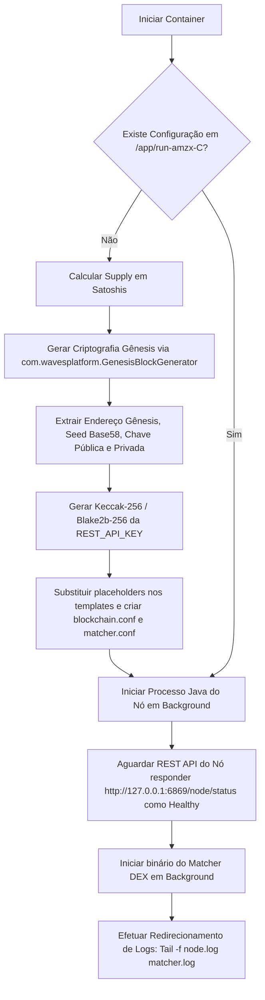

# 🐳 Deploy Consolidado em VPS com Docker de Alta Performance (AMZX & Matcher DEX)

Este guia documenta a arquitetura de implantação de produção simplificada para o ecossistema **AMZX** utilizando contêineres Docker consolidados. Esta solução empacota o **AMZX Private Node** (Blockchain Core) e o **AMZX Matcher DEX** em uma única imagem de contêiner baseada no OpenJDK 17 LTS, otimizando o consumo de RAM em servidores virtuais privados (VPS) e provendo inicialização resiliente e parametrizada por variáveis de ambiente.

---

## 🏗️ 1. Arquitetura do Contêiner Consolidado

Diferente de arquiteturas complexas baseadas em microsserviços pesados, a imagem consolidada AMZX é projetada sob os seguintes pilares de engenharia:
*   **Base Leve (Eclipse Temurin 17 JRE):** Utilização do runtime homologado OpenJDK 17 sob Ubuntu Jammy, reduzindo o overhead do sistema operacional.
*   **Single-Container Orchestration:** Inicialização em segundo plano controlada por um script orquestrador inteligente (`entrypoint.sh`), que gerencia o ciclo de vida do processo Java do Nó e do binário do Matcher.
*   **Dynamic Genesis Generation:** Geração criptográfica automatizada e em tempo real dos blocos gênesis caso nenhuma configuração seja encontrada na primeira execução, permitindo inicializar redes totalmente novas apenas alterando variáveis do comando `docker run`.
*   **Volume Consolidado Único:** Mapeamento de um único volume Docker (`amzx-data:/app/run-amzx-C`) que retém tanto os arquivos de configuração autogerados quanto os estados persistidos de bancos de dados RocksDB (Blockchain) e LevelDB (Matcher), facilitando backups e atualizações.

---

## 📡 2. O Desafio Crossover do gRPC Keep-Alive (too_many_pings)

Durante a integração de microsserviços gRPC em redes internas de contêineres, um problema comum de infraestrutura surgiu no canal de comunicação da extensão **`BlockchainUpdates`** (porta `6881`):

### O Mecanismo da Falha (Keepalive Strike):
1. O **Matcher DEX** (gRPC Client) é programado por padrão para enviar pings keep-alive síncronos de pulsação a cada **10 segundos** para garantir que a conexão gRPC com a blockchain esteja ativa.
2. O **Nó AMZX** (gRPC Server / extensão `BlockchainUpdates`), por padrão, vem com uma regra restritiva de segurança herdeira de redes públicas: aceitar pings em intervalos não inferiores a **5 minutos** (`min-keep-alive = 5m`).
3. Quando o Matcher gRPC envia pings subsequentes antes de 5 minutos, o servidor do Nó considera isso uma violação de segurança (ataque de negação de serviço ou flood), gerando um "keepalive strike".
4. Após algumas violações consecutivas, o Nó fecha abruptamente a conexão enviando um sinal `GO_AWAY` com código HTTP/2 `ENHANCE_YOUR_CALM` e mensagem interna de depuração `too_many_pings`.
5. Isso causava um loop infinito de reconexão-derrubada que paralisava o motor do Matcher.

### A Solução de Engenharia:
Nós ajustamos o template de configuração do ledger para redefinir o limite de aceitação do servidor para **2 segundos**:
```hocon
# custom-blockchain.conf.template
waves {
  ...
  blockchain-updates {
    grpc-port = __BLOCKCHAIN_UPDATES_PORT__
    min-keep-alive = 2s
  }
}
```
Isso instrui o gRPC Server da blockchain a tolerar pings frequentes do Matcher DEX, garantindo estabilidade vitalícia na sincronização dos canais de subscrição de blocos e transações.

---

## ⚙️ 3. Parâmetros e Variáveis de Ambiente

O contêiner aceita as seguintes variáveis de ambiente dinâmicas que substituem automaticamente os placeholders dos arquivos de configuração durante o bootstrap:

| Variável | Descrição | Valor Padrão |
| :--- | :--- | :--- |
| `CHAIN_ID` | Magic Byte de rede (único caracter ASCII) | `C` |
| `COIN_NAME` | Nome de rebranding da moeda nativa de utilidade | `celeronx` |
| `SUPPLY` | Fornecimento inicial total de moedas (gerado no gênesis) | `10000000` |
| `SEED` | Semente mnemônica (BIP39) geradora da Rich Account de gênesis | `"velvet maple rocket..."` |
| `REST_API_KEY` | Senha em texto claro para chamadas REST administrativas | `"mCMXZKNNAICNmcmzn*()_"` |
| `BASE_DOMAIN` | Domínio base para servidores Web/SSL | `"celeronx.com"` |
| `CERTBOT_EMAIL`| E-mail de notificação de certificados de segurança | `"diegoantunes2301@gmail.com"` |

---

## 🛠️ 4. Fluxo de Geração e Bootstrap (entrypoint.sh)

Quando o contêiner inicia, o script `entrypoint.sh` executa de forma sequencial o seguinte pipeline:



---

## 🚀 5. Roteiro de Build, Exportação e Implantação de Produção

Siga este pipeline rigoroso para construir a imagem na sua máquina local de desenvolvimento, transferi-la para o VPS e inicializar o serviço com isolamento completo de persistência.

### Passo 1: Construção da Imagem Localmente
Navegue até a pasta de configuração docker no seu computador de desenvolvimento e reconstrua a imagem para consolidar os arquivos de template:
```bash
cd /home/diegooris/Documentos/amzblockchain/docker-setup
docker build -t amzx-node-matcher:latest .
```

### Passo 2: Exportação e Compressão da Imagem
Compacte a imagem gerada em um tarball gzip de fácil transferência:
```bash
docker save amzx-node-matcher:latest | gzip > amzx-image.tar.gz
```

### Passo 3: Transferência para a VPS (SCP / SFTP)
Transfira o arquivo de imagem diretamente para o diretório `/root` da sua VPS produtiva:
```bash
scp /home/diegooris/Documentos/amzblockchain/docker-setup/amzx-image.tar.gz root@srv1732863:/root/
```

### Passo 4: Limpeza de Infraestrutura Antiga no VPS (Acesso root VPS)
Acesse a VPS via SSH e garanta que não há contêineres colidindo ou volumes sujos com dados gênesis desalinhados de inicializações anteriores:
```bash
# Pare e remova o contêiner problemático antigo
docker rm -f amzx-node-matcher-container

# Opcional: Remova o volume consolidado de dados antigo para começar uma rede limpa
docker volume rm amzx-data || true
```

### Passo 5: Carregamento da Nova Imagem no VPS
Efetue a descompactação e carregamento da nova imagem atualizada com as correções de keep-alive gRPC no Docker da VPS:
```bash
docker load < /root/amzx-image.tar.gz
```

### Passo 6: Execução Parametrizada de Alta Performance
Instancie o novo contêiner montando o volume persistente e mapeando as portas REST públicas da rede (`6869` para Nó e `6886` para Matcher DEX):
```bash
docker run -d \
  --name amzx-node-matcher-container \
  --restart unless-stopped \
  -p 6869:6869 \
  -p 6868:6868 \
  -p 6886:6886 \
  -p 6887:6887 \
  -p 6881:6881 \
  -v amzx-data:/app/run-amzx-C \
  -e CHAIN_ID=C \
  -e COIN_NAME=celeronx \
  -e SUPPLY=10000000 \
  -e SEED="velvet maple rocket lantern falcon canyon silver meadow thunder ocean biscuit crystal" \
  -e REST_API_KEY="mCMXZKNNAICNmcmzn*()_" \
  -e BASE_DOMAIN="celeronx.com" \
  -e CERTBOT_EMAIL="diegoantunes2301@gmail.com" \
  amzx-node-matcher:latest
```

### Passo 7: Verificação de Sincronização dos Logs
Monitore os logs para verificar o fluxo contínuo de sincronização e validar que a extensão `BlockchainUpdates` está rodando com `2 seconds` de keep-alive estável:
```bash
docker logs -f amzx-node-matcher-container
```

Seus serviços agora estão integrados de forma robusta e persistente, imunes a desconexões gRPC indesejadas e prontos para operar!
