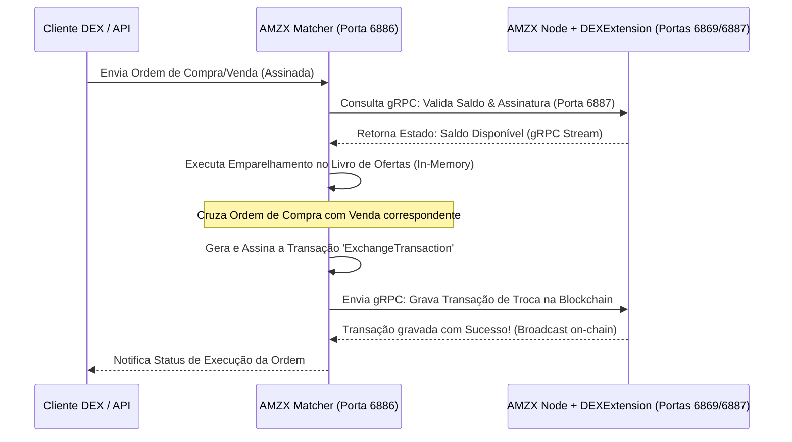

# 📈 Configuração e Integração do AMZX Matcher DEX (Bolsa Descentralizada)

O **AMZX Matcher** é o motor de emparelhamento de ordens em tempo real de alta performance que atua como uma corretora descentralizada (DEX) nativa integrada ao ecossistema AMZX.

Diferente de exchanges centralizadas, o Matcher é **não-custodial**: ele cruza ordens assinadas digitalmente pelos usuários em memória RAM, mas a transferência física dos fundos ocorre diretamente on-chain na blockchain AMZX através de transações atômicas de troca (`ExchangeTransaction`), eliminando por completo o risco de perdas por hacks de custódia ou insolvência da corretora.

---

## 🔗 1. A Conexão gRPC via `DEXExtension`

Para validar saldos em tempo real, monitorar assinaturas de ordens e consultar estados de contas com latência na casa dos microssegundos, o Matcher não utiliza chamadas REST HTTP comuns de leitura. Ele conecta-se diretamente à memória de estados do nó validador através de canais gRPC bidirecionais de alta velocidade.

Essa ponte de comunicação é mantida pela extensão **`DEXExtension`**, que roda acoplada dentro do próprio processo Java do nó Scala.



---

## 🧠 2. Anatomia do Livro de Ofertas em Memória (`OrderBook.scala`)

O núcleo do motor de correspondência (Matching Engine) reside no arquivo `OrderBook.scala` dentro do subprojeto `matcher/dex`. Ele é modelado utilizando estruturas de dados puramente funcionais e imutáveis em Scala para garantir concorrência segura de threads e previsibilidade absoluta de estados.

### A. Estruturas de Dados Internas
O estado do livro de ofertas de um par de ativos é representado pela classe `OrderBook`:

```scala
case class OrderBook private (
  bids: Side,                         // TreeMap ordenada de Ordens de Compra
  asks: Side,                         // TreeMap ordenada de Ordens de Venda
  lastTrade: Option[LastTrade],       // Detalhes da última negociação executada
  orderIds: HashMap[Order.Id, (OrderType, Price)], // Mapeamento rápido de IDs de ordens ativas
  nextTxTimestamp: Long               // Timestamp incremental para transações de troca
)
```

O tipo `Side` é um alias para uma coleção ordenada `TreeMap` em Scala:
*   **Asks (Ofertas de Venda)**: Ordenação ascendente (`Ordering.Long`). A oferta de menor preço é posicionada no topo do livro (`bestAsk`), facilitando sua correspondência imediata com ordens de compra de mercado.
*   **Bids (Ofertas de Compra)**: Ordenação descendente (`bidsOrdering = asksOrdering.reverse`). A oferta de maior preço de compra é posicionada no topo do livro (`bestBid`).
*   **Níveis de Preço (Levels)**: Cada chave do `TreeMap` representa um nível de preço (`Price`), e o valor correspondente é uma fila imutável do tipo `Queue[LimitOrder]`. Novas ordens de preço idêntico são enfileiradas ao final da fila (`FIFO - First In, First Out`).

### B. Algoritmo de Correspondência Tail-Recursive (`doMatch`)
Quando uma nova ordem ativa (`submitted`) é adicionada ao livro, ela é enviada para o algoritmo de correspondência síncrono `doMatch`, que executa um loop recursivo otimizado em cauda (`@tailrec`) para emparelhar as ordens:

1.  **Verificação de Sobreposição (Overlaps)**: O algoritmo verifica se o preço da ordem ativa se sobrepõe ao melhor preço disponível no lado oposto do livro (venda se sobrepõe a compra ou vice-versa).
2.  **Cálculo da Execução**:
    -   **Preço de Execução**: Definido estritamente pelo preço da ordem que já estava passiva no livro (Maker Price), recompensando a liquidez existente.
    -   **Volume Executado**: O menor volume entre a ordem ativa (`submitted`) e a ordem passiva (`counter`).
3.  **Geração do Evento `OrderExecuted`**:
    -   Cria um evento contendo o volume executado, os montantes de taxas (`matcherFee`) cobrados proporcionalmente de cada participante e o timestamp de fechamento.
    -   O Matcher assina digitalmente esse evento e monta a `ExchangeTransaction` correspondente.
4.  **Atualização de Saldos em Memória**:
    -   Se a ordem passiva for completamente preenchida, ela é removida (`unsafeWithoutBest`). Se for preenchida parcialmente, ela é atualizada com o saldo restante (`unsafeUpdateBest`).
    -   Se a ordem ativa ainda possuir saldo a preencher, o loop continua (`loop(submittedRemaining, newUpdates)`) buscando o próximo nível de preço do livro de ofertas.
5.  **Inserção de Sobra**: Caso a ordem ativa não seja totalmente preenchida e seja do tipo `LimitOrder`, o saldo remanescente é inserido no livro de ofertas correspondente na chave de preço ajustada pelo Tick Size (`insert(levelPrice, submitted)`). Se for uma `MarketOrder` (ordem a mercado), qualquer resíduo não preenchido é cancelado imediatamente por falta de contraparte.

---

## 🌐 3. Especificação Completa do Canal WebSocket (`GET /ws/v0`)

O Matcher DEX expõe uma API WebSocket de alta velocidade na porta padrão **`6886`** sob o caminho `/ws/v0` para fornecer dados de mercado em tempo real e atualizações de ordens privadas sem necessidade de polling HTTP repetitivo.

### A. Formato Geral das Mensagens
Todas as mensagens trafegadas pelo canal WebSocket (tanto enviadas pelo cliente quanto enviadas pelo servidor) utilizam o formato JSON e possuem um atributo discriminador **`T`** que define o tipo da mensagem.

---

### B. Mensagens Enviadas pelo Cliente (Client to Server)

#### 1. Inscrição no Livro de Ofertas (`obs`)
Inscreve o cliente para receber deltas de livro de ofertas em tempo real para um par específico com profundidade limite.
*   **Payload JSON**:
    ```json
    {
      "T": "obs",
      "S": "AMZX-8LQW826WA3xXp2CCmXvUvTCE6B2z9kG77D2GZg1h",
      "d": 10
    }
    ```
*   *Campos*: `T` (tipo "obs"), `S` (par de ativos no formato base58 `AssetBase-AssetQuote` ou `"AMZX"` se nativo), `d` (profundidade máxima de níveis do livro, ex: 10, 100).

#### 2. Inscrição de Endereço Privado (`aus`)
Inscreve o cliente para ouvir em tempo real alterações de saldos e atualizações de ordens privadas associadas a uma carteira. Exige autenticação por assinatura via JSON Web Token (JWT).
*   **Payload JSON**:
    ```json
    {
      "T": "aus",
      "S": "3MvYourUserAddressHere...",
      "t": "jwt",
      "j": "eyJhbGciOiJSUzI1NiIsInR5cCI6IkpXVCJ9.eyJhe..."
    }
    ```
*   *Campos*: `T` (tipo "aus"), `S` (endereço da conta), `t` (tipo de autenticação, estritamente `"jwt"`), `j` (string JWT contendo a assinatura criptográfica).
*   **Estrutura do JWT Payload**:
    O token JWT deve conter o payload serializado assinado com a chave privada do usuário:
    ```json
    {
      "a": "3MvYourUserAddressHere...",
      "nb": "C",
      "exp": 1780578400
    }
    ```
    *Onde*: `a` (endereço), `nb` (byte de rede, ex: "C" ou "S"), `exp` (timestamp unix de expiração).

#### 3. Inscrição de Atualizações de Taxas de Câmbio (`ru`)
Inscreve-se nas cotações de taxas operacionais aceitas pela DEX.
*   **Payload JSON**:
    ```json
    {
      "T": "ru",
      "id": "ru"
    }
    ```

#### 4. Cancelar Inscrição (`u`)
Cancela qualquer uma das assinaturas WebSocket ativas utilizando a chave correspondente.
*   **Payload JSON**:
    ```json
    {
      "T": "u",
      "S": "AMZX-8LQW826WA3xXp2CCmXvUvTCE6B2z9kG77D2GZg1h"
    }
    ```

#### 5. Heartbeat Ping/Pong (`pp`)
Utilizado para manter a conexão ativa e medir latência de rede bidirecional.
*   **Payload JSON**:
    ```json
    {
      "T": "pp",
      "timestamp": 1780578324000
    }
    ```

---

### C. Mensagens Enviadas pelo Servidor (Server to Client)

#### 1. Snapshot Inicial / Deltas do Livro de Ofertas (`ob`)
Retorna as alterações de bids e asks sempre que ocorrem execuções ou adições.
*   **Payload JSON**:
    ```json
    {
      "T": "ob",
      "S": "AMZX-8LQW82...",
      "U": 1459203,
      "b": [
        ["3000000", 500000000],
        ["2990000", 120000000]
      ],
      "a": [
        ["3010000", 400000000]
      ],
      "t": 1780578324102
    }
    ```
*   *Campos*: `U` (offset sequencial de update), `b` (bids modificados: array de pares `[preço, quantidade]`), `a` (asks modificados), `t` (timestamp). Uma quantidade `"0"` indica que o nível de preço foi totalmente consumido ou cancelado e deve ser removido.

#### 2. Atualizações de Endereço Privado (`au`)
Notifica instantaneamente alterações de saldos ou status de ordens privadas do usuário conectado.
*   **Payload JSON (Atualização de Saldo)**:
    ```json
    {
      "T": "au",
      "S": "3MvYourUserAddressHere...",
      "b": {
        "AMZX": 1420500000,
        "8LQW82...": 50200000
      },
      "t": 1780578324105
    }
    ```
*   **Payload JSON (Atualização de Status de Ordem)**:
    ```json
    {
      "T": "au",
      "S": "3MvYourUserAddressHere...",
      "o": {
        "i": "89xHnCwD3A...",
        "p": 3000000,
        "a": 500000000,
        "f": 120000000,
        "s": "PartiallyFilled",
        "t": 1780578324110
      }
    ```
*   *Campos do Objeto Ordem (`o`)*: `i` (ID da ordem), `p` (preço), `a` (quantidade total), `f` (quantidade preenchida), `s` (status: "Accepted", "PartiallyFilled", "Filled", "Cancelled").

---

## ⚙️ 4. Parâmetros de Conexão gRPC da DEXExtension

Para garantir estabilidade de fluxo contínuo de dados sem interrupções sob cargas severas de volume, a conexão gRPC entre o Matcher e a `DEXExtension` do Nó é parametrizada sob a diretiva `amzx.dex.grpc-integration` no arquivo de configurações:

```hocon
amzx.dex.grpc-integration {
  # Endereço e porta gRPC do nó blockchain
  target = "127.0.0.1:6887"
  
  # Tempo de espera antes de enviar um ping keep-alive
  keep-alive-time = 2s
  
  # Tempo máximo aguardando resposta do ping keep-alive antes de fechar o canal
  keep-alive-timeout = 5s
  
  # Tamanho limite das mensagens de dados recebidas por chamada gRPC (4MB)
  max-inbound-message-size = 4194304
}
```

*   **Tolerância a Falhas**: Se a conexão gRPC cair (devido à reinicialização ou compilação do nó), o Matcher entra em modo de segurança, suspende o recebimento de novas ordens através do endpoint `/ws/v0` e tenta reconectar sequencialmente ao nó a cada **5 segundos**. Assim que o nó e a extensão `DEXExtension` voltam a responder, o Matcher restabelece as assinaturas de dados, atualiza as posições de saldo on-chain e reativa o emparelhamento de ordens automaticamente.

---

## 📊 5. Parâmetros de Taxas Operacionais da DEX (Matcher Fee)

A DEX opera cobrando uma taxa operacional (Matcher Fee) para processar e registrar transações on-chain. Esta taxa é configurada na seção `amzx.dex.fee` do arquivo `matcher.conf`:

```hocon
amzx.dex.fee {
  order-fee {
    mode = "dynamic"
    dynamic {
      # Taxa operacional padrão cobrada em Satoshis do token AMZX (10^-8)
      # Cobrar 0.003 AMZX fixos por ordem correspondida: 0.003 * 10^8 = 300.000 Satoshis
      base-maker-fee = 300000
      base-taker-fee = 300000
    }
  }
}
```

*   **Taxas em Ativo Nativo (AMZX)**: Para resguardar a utilidade e escassez econômica do token native, o Matcher rejeita ordens que queiram pagar taxas operacionais em ativos de terceiros. Apenas ordens configurando `matcherFeeAssetId = null` (equivalente ao token nativo `AMZX` on-chain) são aceitas e emparelhadas pela corretora.
*   **Proporcionalidade**: Se uma ordem for executada parcialmente, a taxa do Matcher é debitada de forma estritamente proporcional ao volume preenchido on-chain. O restante do saldo da taxa permanece bloqueado até o preenchimento total ou cancelamento da ordem.
*   **ExchangeTransaction Fee Allocation**: A taxa de injeção da transação on-chain (paga aos mineradores da rede, padrão `0.003 AMZX`) é coberta de forma integrada pela própria conta administrativa do Matcher (`account-address`), que por sua vez é financiada pelas taxas operacionais (`base-maker-fee` e `base-taker-fee`) coletadas dos usuários executados.

---

## 🛑 6. Endpoints de Monitoramento e Administração da DEX

A DEX expõe endpoints REST administrativos de controle na mesma porta HTTP do WebSocket (`6886`), exigindo cabeçalho de autenticação `X-Api-Key`:

1.  **GET `/ws/v0/connections`**: Retorna estatísticas detalhadas de todas as conexões WebSocket ativas, divididas por sistema operacional e plataforma de cliente conectado.
2.  **DELETE `/ws/v0/connections`**: Força o fechamento de conexões WebSocket ociosas ou antigas para liberar descritores de arquivos e memória JVM. Aceita o payload `{"oldest": 50}` para desconectar os 50 clientes mais antigos.
3.  **GET `/matcher/status`**: Retorna se o motor da DEX está ativo e operando (`Working`), inicializando (`Starting`) ou em desligamento seguro (`Stopping`).
4.  **POST `/matcher/settings/address`**: Altera dinamicamente as permissões operacionais do Matcher sem parar o processo JVM.

---

## 🛠️ 7. Fluxo de Tratamento de Crash de Memória (RocksDB Snapshot)

Sempre que ordens são cruzadas ou canceladas, além do registro em memória TreeMap, o Matcher escreve instantaneamente os dados de estado no RocksDB local. 
A cada intervalo configurado de blocos (padrão: 100.000 eventos), o Matcher dispara um **Snapshot de Estado**:
1.  Ele congela as TreeMaps temporariamente e escreve uma imagem completa das ordens e posições abertas no diretório local `amz_data/matcher`.
2.  Ao reiniciar (seja por queda de energia ou atualização), o Matcher lê o snapshot do RocksDB e remonta a TreeMap em memória em fração de segundos. Ele então consulta a extensão gRPC do nó a partir do offset correspondente para reprocessar quaisquer transações de bloco ocorridas durante o período offline, garantindo consistência absoluta de dados on-chain.
