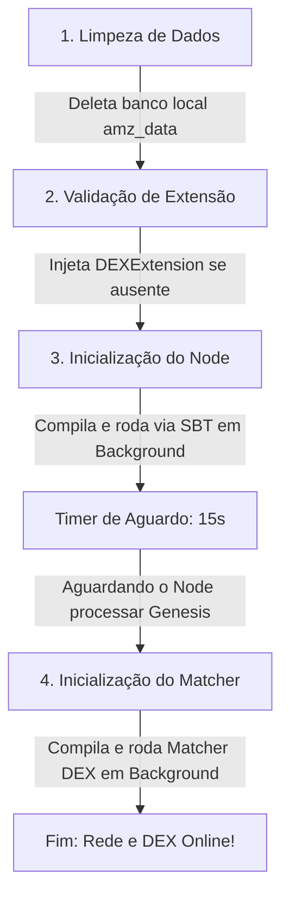

# 🚀 Guia de Inicialização, Monitoramento e Diagnóstico (Operações)

Este documento atua como o manual oficial de operação para ligar, gerenciar, monitorar, diagnosticar e gerenciar carteiras de toda a infraestrutura de rede **AMZX** (Node Scala e Matcher DEX).

---

## 🏃 1. Executando a Rede Local com o Script Unificado (`start_amzx.sh`)

Para simplificar a inicialização e evitar erros manuais de compilação ou conflitos de estado de dados, criamos um script de controle mestre, robusto e altamente visual chamado `start_amzx.sh` localizado na raiz do seu projeto.

### Pré-requisitos de Execução:
- **Sistema Operacional**: Linux (Ubuntu/Debian homologados).
- **JDK instalado**: **OpenJDK 17** (o script define o PATH explicitamente para usar o diretório correto `/usr/lib/jvm/java-1.17.0-openjdk-amd64/bin`).
- **SBT**: Ferramenta de build do Scala instalada e disponível no sistema.

### Como Iniciar:
Abra o seu terminal Linux, navegue até a pasta do projeto e execute os comandos:

```bash
# Garantir permissão de execução ao script
chmod +x start_amzx.sh

# Iniciar o ecossistema completo
./start_amzx.sh
```

---

## 🔍 2. Análise Detalhada do Script de Inicialização (`start_amzx.sh`)

O script `start_amzx.sh` executa uma sequência cirúrgica de quatro etapas para garantir que ambos os serviços subam de forma limpa, estável e na ordem correta de dependências:



### Explicação Passo a Passo das Etapas do Script:

1.  **Limpeza Total de Banco de Dados (`amz_data`)**:
    - **O que faz**: O script executa `rm -rf $DB_DIR/data`, `$DB_DIR/matcher` e `$DB_DIR/state`.
    - **Por que é crucial**: Ao realizar alterações de rebranding de moedas, mudanças nos endereços gênesis ou assinaturas do bloco gênesis, a blockchain existente em disco torna-se incompatível. Deletar os dados antigos garante que o nó reinicie sua base de dados do zero a partir do novo bloco gênesis configurado no `application.conf`.
2.  **Injeção Dinâmica de Extensão gRPC**:
    - **O que faz**: Ele varre o arquivo `application.conf` do nó. Se não encontrar o caminho para a classe `DEXExtension`, ele a injeta automaticamente ao final do arquivo:
      `amzx.extensions += com.amzblockchain.dex.grpc.integration.DEXExtension`
    - **Por que é crucial**: Impede que o nó inicie sem abrir a porta gRPC `6887`, o que faria o Matcher falhar ao tentar conectar.
3.  **Compilação e Execução do Node em Background**:
    - **O que faz**: Navega até a pasta `amzx`, e dispara o comando:
      `nohup sbt "node/run $NODE_CONF" > "$DB_DIR/amzx_node.log" 2>&1 &`
    - **Por que é crucial**: Usa o comando `nohup` (no hang up) juntamente com o caractere `&` no final para desacoplar o processo sbt do terminal ativo. Se o terminal for fechado, o nó continua rodando silenciosamente. Toda a saída de compilação e logs de depuração do console do nó são redirecionados para o arquivo `amzx_node.log`.
    - **Timer de Espera de 15 Segundos**: O script para a execução temporariamente por 15 segundos para dar tempo suficiente ao SBT de inicializar o compilador do nó, processar o bloco gênesis e abrir as conexões gRPC de streaming na porta `6887` antes do Matcher subir.
4.  **Compilação e Execução do Matcher DEX em Background**:
    - **O que faz**: Entra na pasta `matcher` e dispara:
      `nohup sbt "dex/run" > "$DB_DIR/amzx_matcher.log" 2>&1 &`
    - **Por que é crucial**: Inicia o motor da DEX em background, enviando todos os seus logs para `amzx_matcher.log`. O Matcher encontra a extensão gRPC do nó já ativa e inicia o Livro de Ofertas instantaneamente de forma integrada.

---

## 📈 3. Monitoramento em Tempo Real (Leitura de Logs)

Uma vez disparados pelo script, você pode acompanhar a compilação, o carregamento inicial e a mineração contínua de blocos da rede abrindo novos terminais e executando os comandos abaixo:

### Acompanhar logs do AMZX Node (Blockchain):
```bash
tail -f /home/diegooris/amz_data/amzx_node.log
```
*Dica de Sucesso*: Quando o nó estiver 100% carregado e minerando de forma ativa, você verá logs periódicos de consenso do tipo:
`Miner - Generator - Block forged and broadcasted: height = 142, signature = ...`

### Acompanhar logs do AMZX Matcher (Corretora):
```bash
tail -f /home/diegooris/amz_data/amzx_matcher.log
```
*Dica de Sucesso*: Quando o Matcher conectar-se de forma correta ao nó e inicializar seu banco interno de ordens, você verá:
`DEX Matcher - Connection to gRPC server established successfully! Starting order matching queue.`

---

## 🛑 4. Como Encerrar com Segurança todos os Processos

Caso você precise aplicar modificações nos códigos Scala, alterar chaves ou ajustar arquivos de configuração e queira reiniciar a infraestrutura, você deve derrubar os processos sbt e Java em segundo plano.

Execute o comando abaixo para pará-los de forma limpa e imediata:

```bash
# Derruba processos que estão executando sbt ou instâncias Java associadas ao sbt
pkill -f sbt
pkill -f java
```

Você também pode verificar se ainda restam portas presas sendo usadas em background executando:
```bash
netstat -tunlp | grep -E "6869|6886|6887"
```

---

## 💳 5. Gestão Completa de Carteiras via REST API (`Wallet Management`)

O gerenciamento de contas, chaves e saldos pode ser feito diretamente na REST API do Nó (porta padrão `6869`). Por questões de segurança, a API exige o cabeçalho **`X-API-Key`** contendo a palavra-passe em texto plano, que deve bater com o hash duplo SHA-256 configurado em `amzx.rest-api.api-key-hash` no arquivo do nó.

*Exemplo de Palavra-Passe configurada nas APIs abaixo*: `sua_api_key_secreta`

### 1. Criar e Adicionar um Novo Endereço
Gera deterministicamente uma nova chave privada, chave pública e endereço derivado na carteira ativa local do nó, avançando o contador de índice sequencial (*nonce*).
*   **Comando Curl**:
    ```bash
    curl -X POST http://127.0.0.1:6869/addresses \
         -H "X-API-Key: sua_api_key_secreta" \
         -H "Content-Type: application/json"
    ```
*   **Payload de Resposta (JSON)**:
    ```json
    {
      "address": "3MvYourNewGeneratedAddress43Ksd9Fq73Lw"
    }
    ```

---

### 2. Listar Todos os Endereços da Carteira do Nó
Lista em ordem de índice sequencial todas as carteiras de posse do nó que foram geradas ou importadas para o arquivo criptografado local `wallet.dat`.
*   **Comando Curl**:
    ```bash
    curl -X GET http://127.0.0.1:6869/addresses \
         -H "X-API-Key: sua_api_key_secreta"
    ```
*   **Payload de Resposta (JSON)**:
    ```json
    [
      "3MvYourNewGeneratedAddress43Ksd9Fq73Lw",
      "3MxFirstGenesisOperationalAddressHere...",
      "3MyA947A11y7xskpP8..."
    ]
    ```

---

### 3. Exportar Chave Secreta e Semente (Seed) de uma Carteira
Exporta a semente master criptografada Base58 e a chave secreta de um endereço específico que está sob custódia do nó.
*   **Comando Curl**:
    ```bash
    curl -X GET http://127.0.0.1:6869/addresses/seed/3MvYourNewGeneratedAddress43Ksd9Fq73Lw \
         -H "X-API-Key: sua_api_key_secreta"
    ```
*   **Payload de Resposta (JSON)**:
    ```json
    {
      "address": "3MvYourNewGeneratedAddress43Ksd9Fq73Lw",
      "seed": "4WNhR15xizRv3uYwaXgtMzuvQ8ukKKimoDSp19ms3W3UU9XHgFo8q5jgcnWYKkJ7"
    }
    ```

---

### 4. Remover / Deletar um Endereço da Carteira do Nó
Apaga o registro de uma chave privada e endereço do banco local do arquivo `wallet.dat`.
*   **Comando Curl**:
    ```bash
    curl -X DELETE http://127.0.0.1:6869/addresses/3MvYourNewGeneratedAddress43Ksd9Fq73Lw \
         -H "X-API-Key: sua_api_key_secreta"
    ```
*   **Payload de Resposta (JSON)**:
    ```json
    {
      "deleted": true
    }
    ```

---

### 5. Consultar Detalhes do Balanço de um Endereço
Consulta os saldos detalhados em tempo real (Saldos regular, gerador, disponível e efetivo - que considera arrendamentos LPoS arrendados para outros nós).
*   **Comando Curl**:
    ```bash
    curl -X GET http://127.0.0.1:6869/addresses/balance/details/3MvYourNewGeneratedAddress43Ksd9Fq73Lw
    ```
*   **Payload de Resposta (JSON)**:
    ```json
    {
      "address": "3MvYourNewGeneratedAddress43Ksd9Fq73Lw",
      "regular": 12050000000,
      "generating": 10000000000,
      "available": 12050000000,
      "effective": 12050000000
    }
    ```
    *Nota*: Os montantes de saldo são representados em frações inteiras Satoshis do token nativo ($10^{-8}$ decimals). O saldo acima equivale a `120.5 AMZX` regular.

---

### 6. Consultar Informações de dApp e Script RIDE de uma Conta
Retorna os metadados de compilação, complexidades e funções chamáveis se a conta possuir um contrato inteligente dApp RIDE atachado.
*   **Comando Curl**:
    ```bash
    curl -X GET http://127.0.0.1:6869/addresses/scriptInfo/3MvYourNewGeneratedAddress43Ksd9Fq73Lw
    ```
*   **Payload de Resposta (JSON)**:
    ```json
    {
      "address": "3MvYourNewGeneratedAddress43Ksd9Fq73Lw",
      "script": "AQQAAAAHJG1hdGNoMAUAAAAnZGVwb3NpdGFyTW9lZGE...",
      "scriptText": "DApp(None, List(), [Callable(invocante, ...)], None)",
      "version": 6,
      "complexity": 142,
      "verifierComplexity": 142,
      "callableComplexities": {
        "depositarMoeda": 85
      },
      "extraFee": 400000,
      "publicKey": "AXbaBkJNocyrVpwqTzD4TpUY8fQ6eeRto9k1m2bNCzXV"
    }
    ```

---

### 7. Exportar Semente Completa da Carteira Principal
Retorna a semente primária de todo o arquivo `wallet.dat` em formato codificado Base58. É o endpoint mais sensível da API e deve ser mantido restrito a acessos internos.
*   **Comando Curl**:
    ```bash
    curl -X GET http://127.0.0.1:6869/wallet/seed \
         -H "X-API-Key: sua_api_key_secreta"
    ```
*   **Payload de Resposta (JSON)**:
    ```json
    {
      "seed": "4WNhR15xizRv3uYwaXgtMzuvQ8ukKKimoDSp19ms3W3UU9XHgFo8q5jgcnWYKkJ7qtam9g5i5kLr6g38iJe8Fdgh"
    }
    ```

---

## 🛠️ 6. Guia de Resolução de Problemas (Troubleshooting)

### Problema A: Erro "Genesis block signature is invalid" nos logs do nó
- **Sintoma**: O nó para a execução de forma imediata após o início e imprime logs de erro críticos sobre assinatura gênesis inválida.
- **Causa**: Você alterou parâmetros do bloco gênesis (endereços receptores, timestamp, suprimento inicial de moedas, etc.) no arquivo `application.conf`, mas manteve a assinatura gênesis antiga.
- **Solução**:
  1. Leia o arquivo `/home/diegooris/amz_data/amzx_node.log` com atenção.
  2. Localize a linha de erro `Calculated signature: [STRING_LONGA]`.
  3. Copie essa string longa.
  4. Abra `amzx/node/src/main/resources/application.conf`.
  5. Substitua o valor do campo `genesis.signature` pela string copiada.
  6. Execute `./start_amzx.sh` novamente.

### Problema B: O Matcher falha ao iniciar com erro "Connection Refused" ou "grpc connection failed"
- **Sintoma**: O Matcher tenta subir mas entra em loop de reinicialização ou cai mostrando erros de falha de conexão de canal gRPC.
- **Causa**: O nó Scala ainda está em processo inicial de compilação ou travado computando dados gênesis quando o Matcher foi disparado, ou a porta gRPC `6887` está bloqueada por regras de firewall.
- **Solução**:
  1. Verifique se o nó blockchain já carregou e está ativo executando `curl http://127.0.0.1:6869/blocks/height`. Se a chamada retornar um JSON com a altura correta (ex: `{"height": 1}`), o nó está ativo.
  2. Se o nó ainda estiver compilando, aumente o tempo de pausa `sleep 15` no script `start_amzx.sh` para `sleep 30` para dar mais tempo ao SBT em sua máquina antes de disparar o processo do Matcher.
  3. Certifique-se de que a extensão `DEXExtension` está de fato declarada no `application.conf`.

### Problema C: O validador não está minerando novos blocos (Fica parado na altura 1)
- **Sintoma**: O nó inicia, lê o bloco gênesis perfeitamente, mas nunca avança para o bloco 2 e não gera logs de "Block forged".
- **Causa**: 
  - O campo `amzx.miner.enable` está definido como `no`.
  - O campo `amzx.miner.quorum` está maior que o número de nós conhecidos na rede (em ambientes de teste de nó único, deve ser `0` ou `1`).
  - A carteira configurada no nó não possui o saldo gerador minerador mínimo exigido de **1.000 AMZX** (consulte as transações gênesis para verificar se o endereço da seed ativa recebeu o saldo correto).
- **Solução**:
  1. Altere `amzx.miner.enable = yes` e `amzx.miner.quorum = 1` nas configurações do seu validador.
  2. Confirme se a semente em `amzx.wallet.seed` gera exatamente o mesmo endereço que recebeu moedas no bloco de transações gênesis.

---

## 🛠️ 7. Próximos Passos para Modificações Avançadas

Se você planeja realizar alterações profundas de código-fonte nos algoritmos de consenso, no motor de correspondência (Matching Engine) em memória, no compilador e interpretador de contratos inteligentes RIDE, ou configurar as APIs MetaMask compatíveis, consulte o nosso manual de nível de desenvolvimento:
* **[5_referencia_tecnica_e_desenvolvimento.md](file:///home/diegooris/Documentos/amzblockchain/docs/5_referencia_tecnica_e_desenvolvimento.md)**
