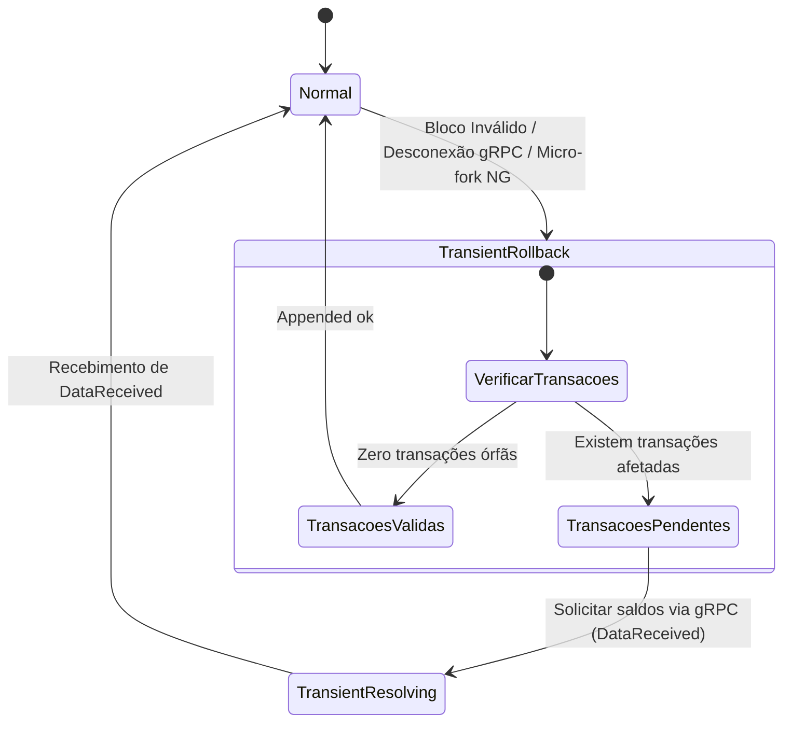

# 🔌 Integração de Baixa Latência: AMZX Node & Matcher DEX

Este documento disseca a mecânica fina e matemática que governa a comunicação e sincronização em tempo real entre o **AMZX Scala Node** (`node`) e o **AMZX Matcher DEX** (`matcher`). O motor financeiro da DEX depende de informações de estado estritas geradas pela blockchain para validar saldos e ordens em frações de milissegundos sem custódia.

---

## 🌊 1. Fusão e Consolidação de Streams de Dados

Para processar eventos de rede de maneira determinística, o Matcher consome múltiplos fluxos de dados (streams) do Nó e os funde em um único canal sequencial de processamento através de atores Akka/Pekko.

### Requisitos de Extensão no AMZX Node:
O Matcher exige que o nó AMZX tenha duas extensões ativas carregadas em sua JVM:
1. **Blockchain Updates Extension (`BlockchainUpdates`)**: Transmite um fluxo contínuo de eventos do ledger (como blocos anexados, micro-blocos gerados ou rollbacks de cadeias).
2. **Matcher Extension (`MatcherExtension`)**: Provê canais adicionais de alto desempenho para consulta de saldos on-chain e transmissão em tempo real de eventos da mempool (UTX).

Os clientes dessas extensões na JVM do Matcher são acoplados. Se qualquer uma das conexões gRPC de stream falhar ou for interrompida, todo o subsistema de streams do Matcher é encerrado de forma coordenada para evitar inconsistências de saldos.

```
 +-----------------------------------------------------------------+
 |                           AMZX Node                             |
 |                                                                 |
 |  +-------------------------+       +-------------------------+  |
 |  |  Blockchain Updates Ext |       |  Matcher Extension Ext  |  |
 |  +-------------------------+       +-------------------------+  |
 +-----------------------------------------------------------------+
               |                                   |
               | gRPC Blockchain stream            | gRPC UTX & Balance stream
               v                                   v
 +-----------------------------------------------------------------+
 |                         AMZX Matcher                            |
 |                                                                 |
 |   [Merged stream: Blockchain + UTX + Synthetic DataReceived]    |
 |                                                                 |
 |                               v                                 |
 |                     [Matcher State Machine]                     |
 +-----------------------------------------------------------------+
```

### Tipos de Fluxos (Streams):
*   **Blockchain Stream**: Eventos ordenados de blocos (`Appended`, `RolledBack`).
*   **UTX Stream**: Notificações em tempo real sobre transações injetadas na mempool ou removidas dela (`UtxUpdated`, `UtxSwitched`).
*   **DataReceived Stream**: Um fluxo sintético gerado localmente pelo Matcher que entrega saldos que foram explicitamente solicitados de forma manual ao nó em momentos de sincronização ou recuperação de forks.

Ao consolidar esses três fluxos em um barramento unificado de mensagens, o Matcher garante que todos os atores internos leiam eventos na exata ordem cronológica em que ocorreram.

---

## ⚙️ 2. A Máquina de Estados do Matcher (State Machine)

O comportamento do Matcher em relação ao processamento dos blocos e eventos de saldo é regido por uma máquina de estados estrita (representada pela classe `StatusTransitions`). 

Um dos princípios fundamentais de consistência do Matcher é: **o Matcher nunca solicita o próximo evento da blockchain até terminar de processar o evento atual**.



### Descrição Detalhada dos Estados:

#### A. Estado: `Normal`
Neste estado, o Matcher está recebendo blocos e micro-blocos on-chain sequencialmente, e todos eles estendem de forma linear a cadeia ativa.
*   **Saída para `TransientRollback`**: Ocorre quando o Matcher recebe um bloco inválido (`Appended invalid`), enfrenta uma queda temporária de conexão com o nó, ou encontra um **micro-fork** do protocolo Waves-NG (um Key Block que aponta para um bloco anterior ao último micro-bloco).

#### B. Estado: `TransientRollback`
Neste estado, o Matcher suspende o cruzamento regular de ordens e tenta ativamente resolver um fork ou rollback ocorrido na blockchain.
*   Quando a blockchain sofre uma reorganização de cadeia, certas transações que estavam confirmadas no fork abandonado podem desaparecer da nova cadeia ativa.
*   **Decisão de Transição**:
    *   Se nenhuma transação pendente ou saldo relevante foi afetado pelo rollback, o Matcher simplesmente atualiza seu ponteiro de altura e retorna imediatamente ao estado `Normal` (`Appended ok`).
    *   Se houver transações órfãs que afetam os saldos de usuários com ordens ativas, o Matcher dispara chamadas gRPC para o nó para consultar os novos saldos em tempo real e transiciona para o estado `TransientResolving`, aguardando as respostas.

#### C. Estado: `TransientResolving`
Neste estado, o Matcher está bloqueado aguardando o recebimento dos dados de saldo sincronizados (`DataReceived`). Assim que esses dados sintéticos chegam e são aplicados em memória, o Matcher transiciona de volta para o estado `Normal`.

---

## 🔱 3. Resolução Matemática de Forks de Cadeia

Para evitar oscilações de saldos falsos (flickering) na tela dos usuários durante reorganizações de rede, o Matcher utiliza algoritmos de detecção de forks (implementados na classe `WavesFork` e representados por `WavesChain`).

Na blockchain AMZX, o tamanho máximo permitido para rollback de blocos é de **100 blocos**. O Matcher mantém os últimos 100 blocos em memória RAM para poder retroceder o estado caso ocorra um fork.

### Prova de Peso de Cadeias (baseTarget):
Um nó validador não pode alternar para uma cadeia que possua menor score acumulado de consenso. O score de uma cadeia de blocos é calculado somando-se os pesos inversos dos `baseTarget` de cada bloco.

Abaixo está a prova matemática de porque uma cadeia de tamanho superior sempre possui maior score acumulado e porque o Matcher espera pelo recebimento de um bloco ou micro-bloco para fechar o fork com segurança:

Seja a pontuação de uma cadeia de 1 bloco:
$$\text{Score}_1 = \frac{X}{\text{baseTarget}_0}$$

E a pontuação de uma cadeia de 2 blocos:
$$\text{Score}_2 = \frac{X}{\text{baseTarget}_1} + \frac{X}{\text{baseTarget}_2} = \frac{X \cdot (\text{baseTarget}_1 + \text{baseTarget}_2)}{\text{baseTarget}_1 \cdot \text{baseTarget}_2}$$

Para que o score da cadeia mais curta superasse a cadeia mais longa, deveríamos assumir:
$$\text{Score}_1 > \text{Score}_2 \implies \frac{X}{\text{baseTarget}_0} > \frac{X \cdot (\text{baseTarget}_1 + \text{baseTarget}_2)}{\text{baseTarget}_1 \cdot \text{baseTarget}_2}$$

Como o cálculo do `baseTarget` é baseado no atraso entre os blocos e o histórico imediato, no limite estável temos $\text{baseTarget}_0 \approx \text{baseTarget}_1$. Substituindo:
$$\frac{1}{\text{baseTarget}_0} > \frac{\text{baseTarget}_0 + \text{baseTarget}_2}{\text{baseTarget}_0 \cdot \text{baseTarget}_2} \implies \text{baseTarget}_0 \cdot (\text{baseTarget}_0 + \text{baseTarget}_2) < \text{baseTarget}_0 \cdot \text{baseTarget}_2$$

$$\text{baseTarget}_0^2 < 0$$

Como o valor de `baseTarget` é um número real estritamente positivo, a desigualdade acima é **impossível**. Portanto, uma cadeia mais longa sempre possui maior score matemático acumulado, impedindo que reorganizações de blocos antigos desestabilizem a rede. 

Ao encontrar um fork, o Matcher rastreia quais endereços foram modificados na cadeia órfã em relação à cadeia principal através do cálculo do `changesDiff` de conjuntos de chaves públicas, solicitando atualizações estritamente para as contas afetadas.

---

## 📊 4. Dicionário de Saldos e Transações do Matcher

O gerenciamento de liquidez e saldos dentro da memória do Matcher segue regras estritas para evitar "gasto duplo preventivo" (Double Spending de ordens abertas).

### A. Tipos de Saldos:

| Tipo de Saldo | Equação / Definição | Descrição Técnica |
| :--- | :--- | :--- |
| **Regular Balance** | Saldo On-chain Puro | O saldo total e líquido gravado na blockchain na última altura conhecida. |
| **Outgoing Leasing** | Valor Arrendado Saída | Fração de moedas AMZX que o usuário arrendou para um validador (indisponível para trading). |
| **Pessimistic Correction** | Soma de Gastos não Confirmados | Ajuste conservador baseado nas transações não confirmadas (UTX) enviadas pelo usuário. |
| **Reserved** | Total em Ordens Abertas | Moedas bloqueadas em ordens de compra ou venda ativas no TreeMap do livro de ofertas. |
| **Node Balance** | $$\text{Regular} - \text{Outgoing Leasing} - \text{Pessimistic Correction}$$ | O saldo real operacional disponível para o nó de rede. |
| **Tradable Balance** | $$\text{Node Balance} - \text{Reserved}$$ | O saldo real que o usuário pode utilizar para abrir novas ordens na DEX. |
| **Balance for Audit** | Critério de Exclusão de Ordens | Parâmetro usado pelo `AddressActor` para decidir se deve cancelar ordens ativas em lote devido à falta de fundos. |

### B. Estados de Transações:
*   **Observed Transaction**: Qualquer transação que tenha passado pela visibilidade do Matcher em qualquer um de seus 3 estados: *failed*, *unconfirmed* ou *confirmed*.
*   **Failed Transaction**: Transações rejeitadas pelas regras de consenso (como falta de taxa ou script inválido) que nunca serão incluídas em um bloco.
*   **Unconfirmed Transaction**: Transações flutuando na mempool (UTX).
*   **Confirmed Transaction**: Transações gravadas e seladas em um bloco válido da blockchain.
*   **Known Transaction**: Transações geradas diretamente por esta instância do Matcher (por exemplo, quando o motor de correspondência gera uma `ExchangeTransaction` resultante de um match). Transações de terceiros ou criadas fora da DEX são tratadas como **Unknown Transactions**.

---

## 🎯 5. Mecanismo de Cancelamento Automático (Auto-Canceling)

O Matcher cancela automaticamente as ordens abertas de um usuário se o seu **Tradable Balance** cair abaixo do volume necessário para cobrir a ordem (por exemplo, se o usuário transferiu seus tokens para outra carteira por fora da DEX).

Para evitar que rollbacks temporários ou atrasos na mempool causem ondas de cancelamentos falsos, o Matcher utiliza um cache de deduplicação no ator `OrderEventsCoordinatorActor` e regras estritas de repetição para retransmissões de transações via gRPC (`checkedBroadcast` e `canRetry`).

### Tabela Mestre de Casos de Corrida de Transações (Race Conditions)

Esta tabela mapeia todos os 45 cenários de sincronização quando múltiplas instâncias de nós e Matchers concorrem. Ela descreve se o evento é fisicamente possível na rede e como o Matcher lida com isso.

*Legenda de Cores e Probabilidades:*
🟥 - Altamente provável (Fluxo normal)
🟧 - Provável em momentos de alta carga
🟨 - Raro (Ocorre em instâncias de forks severos)
⬜ - Impossível pelas regras de consenso

| Caso | Evento Blockchain (BE) | Evento Matcher (ME) | Evento BE Pós-Matcher | Status | Descrição Detalhada |
| :---: | :--- | :--- | :--- | :---: | :--- |
| **1** | Confirmed | Confirmed | Confirmed | **🟧** | Ocorre durante rollbacks. O UtxStream reenvia transações não confirmadas primeiro. |
| **2** | Confirmed | Confirmed | Unconfirmed | **🟧** | Durante rollbacks temporários de micro-blocos. |
| **3** | Confirmed | Confirmed | Failed | **⬜** | Impossível. Um bloco confirmado não pode ser marcado como failed se o match foi bem-sucedido. |
| **4** | Confirmed | Unconfirmed (Novo) | Confirmed | **⬜** | Praticamente impossível por corrida de rede, mas tratado sem problemas. |
| **5** | Confirmed | Unconfirmed (Novo) | Unconfirmed | **🟨** | Ocorre entre a remoção de um bloco e a reinjeção na UTX pelo nó. |
| **6** | Confirmed | Unconfirmed (Novo) | Failed | **⬜** | Uma transação on-chain não se torna failed na mesma altura. |
| **7** | Confirmed | Unconfirmed (Existente) | Confirmed | **🟥** | **Condição Normal**. Caminho feliz padrão do protocolo. |
| **8** | Confirmed | Unconfirmed (Existente) | Unconfirmed | **🟨** | Rollback ocorrendo exatamente durante a verificação de saldo da mempool. |
| **9** | Confirmed | Unconfirmed (Existente) | Failed | **⬜** | Transação invalidada pós-confirmação. Apenas aplicável a ativos com scripts que quebram temporalmente. |
| **10** | Confirmed | Failed (Sem Retentativa) | Confirmed | **⬜** | Impossível. O nó não confirmaria uma transação que o validador marcou como inválida. |
| **11** | Confirmed | Failed (Sem Retentativa) | Unconfirmed | **🟨** | Transação removida da UTX de forma silenciosa por expiração sem aviso de saída. |
| **12** | Confirmed | Failed (Sem Retentativa) | Failed | **🟨** | Ocorre durante rollbacks violentos onde o validador descarta a transação por taxa. |
| **13** | Confirmed | Failed (Permite Retentativa) | Confirmed | **🟨** | Ocorre se a UTX do nó estava cheia mas a transação foi aceita logo depois por outro nó. |
| **14** | Confirmed | Failed (Permite Retentativa) | Unconfirmed | **🟨** | UTX temporariamente lotada, reinserida pelo Matcher na rodada subsequente. |
| **15** | Confirmed | Failed (Permite Retentativa) | Failed | **🟨** | Transação se torna inválida durante o rollback (ex: limite de tempo expirado). |
| **16** | Unconfirmed | Confirmed | Confirmed | **🟥** | **Caminho Feliz Secundário**. Transação enviada para UTX e confirmada no próximo bloco. |
| **17** | Unconfirmed | Confirmed | Unconfirmed | **🟧** | Sincronização e reinjeção de mempool após queda de rede do nó minerador. |
| **18** | Unconfirmed | Confirmed | Failed | **⬜** | Consenso garante que transações válidas na mempool não falham sem alteração de estado. |
| **19** | Unconfirmed | Unconfirmed (Novo) | Confirmed | **🟨** | Latência de escrita em disco (RocksDB) faz com que o bloco pareça unconfirmed. |
| **20** | Unconfirmed | Unconfirmed (Novo) | Unconfirmed | **🟨** | Concorrência de leitura e escrita do RocksDB em nós sob carga extrema de IOPS. |
| **21** | Unconfirmed | Unconfirmed (Novo) | Failed | **🟥** | Transação de script de conta falha por alteração de estado dinâmico (ex: Oráculo). |
| **22** | Unconfirmed | Unconfirmed (Existente) | Confirmed | **🟥** | Fluxo estável normal sob taxas variáveis. |
| **23** | Unconfirmed | Unconfirmed (Existente) | Unconfirmed | **🟥** | Transação aguardando no topo da mempool por espaço no bloco chave Waves-NG. |
| **24** | Unconfirmed | Unconfirmed (Existente) | Failed | **🟥** | Script de asset retorna falso após mudança de altura na blockchain. |
| **25** | Unconfirmed | Failed (Sem Retentativa) | Confirmed | **⬜** | Um nó não confirma transações descartadas de forma definitiva por falta de assinatura. |
| **26** | Unconfirmed | Failed (Sem Retentativa) | Unconfirmed | **⬜** | Assinatura quebrada impede a transação de persistir na mempool. |
| **27** | Unconfirmed | Failed (Sem Retentativa) | Failed | **🟥** | Transações que violam regras estáticas de tamanho ou estrutura de bytes de dados. |
| **28** | Unconfirmed | Failed (Permite Retentativa) | Confirmed | **🟨** | Problema de concorrência de rede resolvido por broadcasting secundário. |
| **29** | Unconfirmed | Failed (Permite Retentativa) | Unconfirmed | **🟨** | Retransmitida devido a limitação temporária de taxa de transferência gRPC. |
| **30** | Unconfirmed | Failed (Permite Retentativa) | Failed | **🟨** | Transação falha após múltiplas retentativas devido à flutuação de taxas da rede. |
| **31** | Failed | Confirmed | Confirmed | **⬜** | Impossível. O ledger não confirmará transações que falharam na validação inicial. |
| **32** | Failed | Confirmed | Unconfirmed | **⬜** | Transações inválidas não entram na mempool de nós íntegros. |
| **33** | Failed | Confirmed | Failed | **⬜** | Contradição interna de dados de transações em threads concorrentes. |
| **34** | Failed | Unconfirmed (Novo) | Confirmed | **⬜** | Garantia matemática de validação de bloco impede inclusão de transações nulas. |
| **35** | Failed | Unconfirmed (Novo) | Unconfirmed | **⬜** | Filtros de validação estática de transações na entrada da UTX barram o avanço. |
| **36** | Failed | Unconfirmed (Novo) | Failed | **⬜** | Estado nulo de processamento duplo de transações inexistentes. |
| **37** | Failed | Unconfirmed (Existente) | Confirmed | **⬜** | Assinatura incorreta impede a mineração de transações do pool. |
| **38** | Failed | Unconfirmed (Existente) | Unconfirmed | **⬜** | Rejeição por estouro de limite de tempo da mempool. |
| **39** | Failed | Unconfirmed (Existente) | Failed | **⬜** | Transação órfã descartada por falta de fundos das contas envolvidas. |
| **40** | Failed | Failed (Sem Retentativa) | Confirmed | **⬜** | Uma transação marcada como permanentemente inválida nunca é minerada. |
| **41** | Failed | Failed (Sem Retentativa) | Unconfirmed | **⬜** | Rejeitada na API REST e descartada antes do barramento gRPC. |
| **42** | Failed | Failed (Sem Retentativa) | Failed | **🟥** | **Transação Inválida Estática**. Rejeição imediata por assinatura corrompida. |
| **43** | Failed | Failed (Permite Retentativa) | Confirmed | **⬜** | Bloqueada pelo validador devido a estouro de limite de gas RIDE. |
| **44** | Failed | Failed (Permite Retentativa) | Unconfirmed | **⬜** | Transação descartada de forma irrecuperável por estouro de tamanho de payload. |
| **45** | Failed | Failed (Permite Retentativa) | Failed | **⬜** | Exaustão de retentativas para transações com falha crônica de script. |
