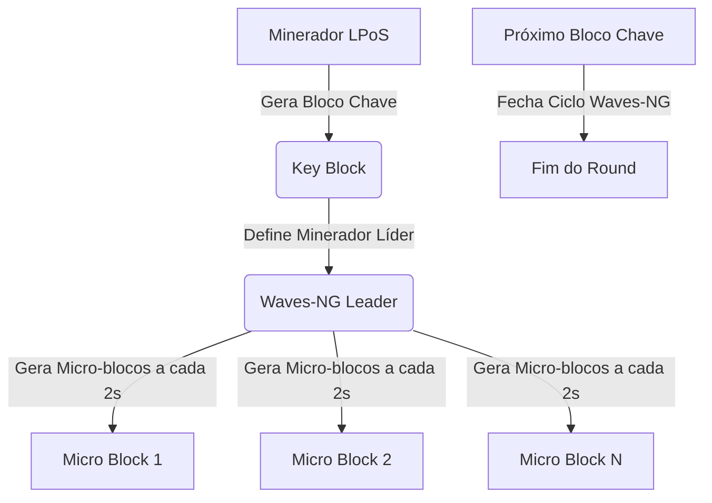
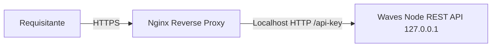

# Guia Técnico de Referência da Blockchain Waves - Manual de Engenharia e Operação

Este documento centraliza as especificações técnicas completas da blockchain Waves, extraídas diretamente do código-fonte local. Ele cobre desde os processos de build até as integrações com gRPC, carteiras criptográficas via REST API, o gerador de gênesis customizado e a infraestrutura completa de compatibilidade com **MetaMask (Ethereum JSON-RPC)** e **Smart Contracts**.

---

## 📂 Arquivo de Documentação
Esta documentação completa e atualizada está salva localmente no arquivo do seu workspace de dados em:
`file:///home/diegooris/.gemini/antigravity/brain/e36c7628-2d93-4f78-8b48-b92eba70627f/analysis_results.md`

---

## 1. Visão Geral da Arquitetura Waves

A Waves adota um modelo híbrido de alto desempenho combinando **Leased Proof of Stake (LPoS)** e o protocolo de consenso de blocos rápidos **Waves-NG**.



### Mecanismos de Consenso Core
*   **Leased Proof of Stake (LPoS)**: Usuários que possuem fundos mas não desejam rodar nós mineradores podem arrendar (*lease*) seus saldos de Waves para nós geradores. Isso aumenta a capacidade de mineração (*generating balance*) do nó arrendatário sem que haja transferência de custódia física dos fundos.
*   **Waves-NG**: Divide o round de mineração em duas etapas. Um nó minerador cria um **Key Block** (bloco chave) contendo apenas o cabeçalho e provas criptográficas. Uma vez aceito, esse minerador torna-se o líder autorizado do round e pode emitir **Micro Blocks** (micro-blocos) com transações reais em intervalos de 1.5 a 2 segundos, reduzindo a latência da rede.
*   **RocksDB**: A Waves utiliza o banco de dados embutido **RocksDB** para armazenar o estado global da rede (State) e o histórico de transações. Ele provê caches rápidos e filtros de Bloom otimizando a validação e buscas rápidas de saldos via REST API.

---

## 2. Processo de Compilação e Artefatos do SBT

O ecossistema de compilação é orquestrado através do **SBT (Scala Build Tool)**. Os comandos principais para gerar binários e pacotes de instalação utilizam a tarefa customizada `packageAll` definida no arquivo [build.sbt](file:///home/diegooris/Documentos/amzblockchain/waves/build.sbt).

### Comandos de Compilação

Para compilar e gerar todos os pacotes nativos da rede **Mainnet** padrão, utilize:
```bash
JAVA_HOME=/usr/lib/jvm/java-17-openjdk-amd64 sbt packageAll
```

Para compilar especificamente para a rede **Testnet**, informe a propriedade de rede do JVM:
```bash
JAVA_HOME=/usr/lib/jvm/java-17-openjdk-amd64 sbt -Dnetwork=testnet packageAll
```

### O que o comando `packageAll` executa?
Conforme mapeado no arquivo `build.sbt`, o comando `packageAll` executa sequencialmente as seguintes tarefas:
1.  `node / assembly`: Compila as fontes de Scala e empacota um JAR consolidado (*fat JAR*) autoexecutável.
2.  `ride-runner / assembly`: Compila e empacota o gerador/executor autônomo do ambiente RIDE.
3.  `buildDebPackages`: Constrói pacotes Debian oficiais para sistemas baseados em Debian/Ubuntu.
4.  `buildTarballsForDocker`: Compacta o node e o servidor gRPC em formato tarball (`.tgz`) e copia os arquivos para o diretório de construção do Docker (`docker/target`).

### Arquivos Gerados e suas Funções

| Caminho do Arquivo Gerado | Tipo / Formato | Função Principal |
| :--- | :--- | :--- |
| `waves/node/target/waves-all-1.6.3.jar` | **Fat JAR** (Java Archive) | O executável principal contendo todas as dependências pré-compiladas. Pode ser iniciado em qualquer sistema com o JRE 17 instalado através do comando `java -jar`. |
| `waves/node/target/waves_1.6.3_amd64.deb` | **Pacote Debian** (AMD64) | Instalador nativo para servidores Linux Ubuntu/Debian de 64 bits. Configura o nó Waves como um serviço systemd executando sob um usuário isolado `waves`. |
| `waves/node/target/waves_1.6.3_arm64.deb` | **Pacote Debian** (ARM64) | Instalador nativo otimizado para servidores com processadores baseados em ARM de 64 bits (ex: AWS Graviton ou Apple Silicon local). |
| `waves/grpc-server/target/grpc-server_1.6.3_all.deb` | **Pacote Debian** (gRPC) | Instalador nativo para o servidor gRPC de extensões. Permite integração rápida com serviços externos usando buffers de protocolo em tempo real. |
| `waves/docker/target/waves.tgz` | **Tarball Compactado** | Arquivo `.tgz` contendo a distribuição universal do node, consumido pelo processo de criação da imagem Docker local da Waves. |
| `waves/docker/target/waves-grpc-server.tgz` | **Tarball Compactado** | Arquivo `.tgz` contendo o servidor gRPC de extensões do node para integração Docker. |

---

## 3. Gestão de Carteiras e Endereços (Wallet Management)

O gerenciamento de chaves e endereços na Waves ocorre localmente dentro do arquivo de dados da carteira (`wallet.dat`), protegido criptograficamente através de uma senha. A Waves utiliza criptografia de curvas elípticas **Curve25519** com funções de hash **Blake2b** e **Keccak256** para a geração de endereços clássicos.

```
+-----------------------------------------------------------+
|                        SEED TEXT                          |
|             (ex: "minha semente secreta")                 |
+-----------------------------------------------------------+
                              |
                              | UTF-8 Bytes
                              v
+-----------------------------------------------------------+
|                        SEED HASH                          |
|                       (Blake2b256)                        |
+-----------------------------------------------------------+
                              |
                              | Wallet.generateNewAccount(..., nonce)
                              v
+-----------------------------------------------------------+
|                   CHAVE PRIVADA (Curve25519)              |
+-----------------------------------------------------------+
                              |
                              | Curve25519.provider
                              v
+-----------------------------------------------------------+
|                   CHAVE PÚBLICA (Curve25519)              |
+-----------------------------------------------------------+
                              |
                              | Hash com Chain ID (Blake2b + Keccak256)
                              v
+-----------------------------------------------------------+
|                   ENDEREÇO WAVES (Base58)                 |
|             (ex: 3M4qwDomRabJKLZxuXhwfqLApQ...)           |
+-----------------------------------------------------------+
```

### Inicialização e Configuração da Wallet no Nó
O arquivo e a semente mestre da carteira são definidos na seção `waves.wallet` do arquivo de configurações:
```hocon
waves.wallet {
  # Caminho para o arquivo criptografado da carteira no disco
  file = "/var/lib/waves/wallet/wallet.dat"
  
  # Senha mestra usada para ler e criptografar o wallet.dat
  password = "uma_senha_de_extrema_seguranca"
  
  # Semente mestre (opcional, em Base58). 
  # Se deixada em branco, o nó gerará uma semente aleatória e segura na primeira inicialização.
  # seed = "BASE58MASTERSEED"
}
```

### Operações de Carteira via REST API do Nó

Se a REST API estiver habilitada e protegida por `api-key-hash`, você poderá gerenciar a carteira em tempo de execução de forma programática através dos seguintes endpoints HTTP locais:

#### 1. Criar ou Gerar um Novo Endereço
Gera uma nova chave privada, chave pública e endereço na carteira associado a um índice sequencial (*nonce*).
*   **Endpoint**: `POST http://localhost:6869/addresses`
*   **Headers**: `X-Api-Key: sua_api_key_secreta`
*   **Resposta**:
    ```json
    {
      "address": "3M4qwDomRabJKLZxuXhwfqLApQkU592nWxF"
    }
    ```

#### 2. Listar Todos os Endereços da Carteira Local
*   **Endpoint**: `GET http://localhost:6869/addresses`
*   **Headers**: `X-Api-Key: sua_api_key_secreta`
*   **Resposta**:
    ```json
    [
      "3M4qwDomRabJKLZxuXhwfqLApQkU592nWxF",
      "3MyA947A11y7xskpP8..."
    ]
    ```

#### 3. Acessar Chaves e Informações de um Endereço Específico
Exibe o par de chaves pública e privada de um endereço sob controle da carteira local do nó.
*   **Endpoint**: `GET http://localhost:6869/addresses/privateKey/3M4qwDomRabJKLZxuXhwfqLApQkU592nWxF`
*   **Headers**: `X-Api-Key: sua_api_key_secreta`
*   **Resposta**:
    ```json
    {
      "address": "3M4qwDomRabJKLZxuXhwfqLApQkU592nWxF",
      "keyType": "ed25519",
      "publicKey": "AXbaBkJNocyrVpwqTzD4TpUY8fQ6eeRto9k1m2bNCzXV",
      "privateKey": "83M4HnCQxrDMzUQqwmxfTVJPTE9WdE7zjAooZZm2jCyV"
    }
    ```

#### 4. Importar / Adicionar Outra Wallet Externa
Você pode importar uma semente externa diretamente para a carteira gerenciada pelo nó.
*   **Endpoint**: `POST http://localhost:6869/addresses/sign`
*   **Headers**: `X-Api-Key: sua_api_key_secreta`
*   Ao atualizar o arquivo `waves-custom.conf` com uma nova semente em `waves.wallet.seed`, o nó atualiza automaticamente os endereços gerados por padrão.

---

## 4. Guia Detalhado de Criação de Rede Customizada (Private Blockchain)

Para lançar uma rede privada Waves (Rede `CUSTOM`), é obrigatório criar e assinar um **bloco gênesis** válido e preencher todas as pre-ativações de recursos em um arquivo de configuração estruturado.

### Passo 1: Criando o Arquivo de Entrada para o Gerador (`genesis-generator.conf`)

Crie um arquivo temporário chamado `genesis-generator.conf` com a seguinte estrutura:

```hocon
# Configuração para geração do bloco gênesis
genesis-generator {
  # Primeiro caractere define o Chain ID criptográfico. "C" equivale a 67.
  networkType = "Custom"
  
  # Atraso médio esperado entre blocos
  averageBlockDelay = 10s
  
  # Tempo mínimo entre blocos (importante para FairPoS / Waves-NG)
  minBlockTime = 5s
  
  # Ativação prévia de features vitais para consistência e alta performance
  preActivatedFeatures = [1, 2, 3, 4, 5, 6, 7, 8, 9, 10, 11, 12, 13, 14, 15, 16, 17, 18, 19, 20, 22, 24, 25]

  # Distribuição de tokens inicial
  # IMPORTANTE: a quantidade de tokens deve ser especificada em frações decimais (multiplicada por 10^8)
  distributions = [
    {
      seedText = "amzblockchain seed de mineracao e distribuicao inicial node 1"
      amount = 5000000000000000  # 50.000.000,00000000 WAVES
      miner = true
    },
    {
      seedText = "amzblockchain seed de fundacao e carteira corporativa node 2"
      amount = 5000000000000000  # 50.000.000,00000000 WAVES
      miner = true
    }
  ]
}
```

### Passo 2: Rodando o Gerador de Gênesis

Para rodar usando o comando integrado do SBT:
```bash
JAVA_HOME=/usr/lib/jvm/java-17-openjdk-amd64 sbt "generateGenesis genesis-generator.conf"
```

Ou, caso prefira executar diretamente através do Fat JAR gerado anteriormente:
```bash
java -cp waves/node/target/waves-all-1.6.3.jar com.wavesplatform.GenesisBlockGenerator genesis-generator.conf
```

#### Exemplo de Saída Gerada no Terminal:
```text
Addresses:

 Seed text:           amzblockchain seed de mineracao e distribuicao inicial node 1
 Seed:                [ByteStr em Base58]
 Account seed:        [ByteStr em Base58]
 Private account key: [Chave Privada em Base58]
 Public account key:  [Chave Publica em Base58]
 Account address:     3M4qwDomRabJKLZxuXhwfqLApQkU592nWxF
 ===

 Seed text:           amzblockchain seed de fundacao e carteira corporativa node 2
 Seed:                [ByteStr em Base58]
 Account seed:        [ByteStr em Base58]
 Private account key: [Chave Privada em Base58]
 Public account key:  [Chave Publica em Base58]
 Account address:     3MyA947A11y7xskpP8...
 ===

Settings:
genesis {
  average-block-delay = 10000ms
  initial-base-target = 1240
  timestamp = 1566817216027
  block-timestamp = 1566817216027
  signature = "4WNhR15xizRv3uYwaXgtMzuvQ8ukKKimoDSp19ms3W3UU9XHgFo8q5jgcnWYKkJ7qtam9g5i5kLr6g38iJe8Fdgh"
  initial-balance = 10000000000000000
  transactions = [
    {recipient = "3M4qwDomRabJKLZxuXhwfqLApQkU592nWxF", amount = 5000000000000000},
    {recipient = "3MyA947A11y7xskpP8...", amount = 5000000000000000}
  ]
}
```

### Passo 3: Criando o Arquivo de Configuração do Nó Custom (`waves.conf`)

Guarde os endereços gerados acima. O nó de mineração precisará da chave privada e da semente associada aos endereços acima para assinar novos blocos. Crie um arquivo chamado `waves-custom.conf` e cole os parâmetros gerados:

```hocon
# Configuração Customizada para a Blockchain Privada
waves {
  # Diretório para armazenamento dos logs, banco de dados RocksDB e arquivos da carteira
  directory = "/var/lib/waves"

  blockchain {
    type: CUSTOM
    custom {
      # Deve ser IDÊNTICO ao caractere definido no gerador de gênesis
      address-scheme-character: "C"
      
      functionality {
        # Janela de verificação e contagem para ativação de novas features (em blocos)
        feature-check-blocks-period = 500
        
        # Quórum mínimo necessário dentro da janela acima para ativar uma feature (ex: 80%)
        blocks-for-feature-activation = 400
        
        reset-effective-balances-at-height: 1
        block-version-3-after-height: 0
        generation-period-length = 1000
        
        # Ativação imediata das features na altura 0
        pre-activated-features = {
          1 = 0
          2 = 0
          3 = 0
          4 = 0
          5 = 0
          6 = 0
          7 = 0
          8 = 0
          9 = 0
          10 = 0
          11 = 0
          12 = 0
          13 = 0
          14 = 0
          15 = 0
          16 = 0
          17 = 0
          18 = 0
          19 = 0
          20 = 0
          22 = 0
          24 = 0
          25 = 0
        }
        max-transaction-time-back-offset = 120m
        max-transaction-time-forward-offset = 90m
        min-asset-info-update-interval = 2
        min-block-time = 5s
      }
      
      # Cole exatamente o bloco genesis impresso pelo gerador no Passo 2
      genesis {
        average-block-delay: 10000ms
        initial-base-target: 1240
        timestamp: 1566817216027
        block-timestamp: 1566817216027
        signature: "4WNhR15xizRv3uYwaXgtMzuvQ8ukKKimoDSp19ms3W3UU9XHgFo8q5jgcnWYKkJ7qtam9g5i5kLr6g38iJe8Fdgh"
        initial-balance: 10000000000000000
        transactions = [
          {recipient = "3M4qwDomRabJKLZxuXhwfqLApQkU592nWxF", amount = 5000000000000000},
          {recipient = "3MyA947A11y7xskpP8...", amount = 5000000000000000}
        ]
      }
      
      # Recompensas por Bloco Gerado
      rewards {
        term = 100000
        initial = 600000000  # Recompensa inicial de 6 WAVES por bloco minerado
        min-increment = 50000000
        voting-interval = 10000
      }
    }
  }

  network {
    bind-address = "0.0.0.0"
    port = 6868
    
    # Endereços IPs das outras instâncias mineradoras que compõem sua rede privada
    known-peers = [] 
    node-name = "Miner-Node-1"
    
    # Endereço público exposto para conexões de outros nós
    # declared-address = "SEU_IP_PUBLICO:6868"
  }

  wallet {
    # IMPORTANTE: Coloque a semente correspondente ao seu endereço minerador gênesis
    seed = "amzblockchain seed de mineracao e distribuicao inicial node 1"
    password = "sua_senha_segura"
  }

  rest-api {
    enable = yes
    bind-address = "127.0.0.1" # Por segurança, expor REST API apenas localmente por padrão
    port = 6869
    
    # Hash SHA-256 duplo encodado em Base58 da sua chave de segurança da API
    # Exemplo abaixo equivale a palavra-passe "sua_api_key_secreta"
    api-key-hash = "BNejVjPAWUrXJTqNrTboGPENAJt9PXnmfdtBgMSgs1u3"
    minimum-peers = 0 # Define como 0 para redes privadas que estão iniciando sozinhas
  }

  miner {
    enable = yes
    interval-after-last-block-then-generation-is-allowed = 999d
    max-transactions-in-micro-block = 500
    micro-block-interval = 1500ms
    min-micro-block-age = 0s
    
    # Número de nós conectados necessários para iniciar a mineração. 
    # Em redes privadas pequenas com poucos mineradores, pode ser definido como 1 ou 0
    quorum = 0 
  }
}
kamon.enable = no
metrics.enable = no
```

### Passo 4: Inicializando o Nó da Rede Custom
Com o Fat JAR e o arquivo `waves-custom.conf` prontos:
```bash
java -Xmx4G -jar waves/node/target/waves-all-1.6.3.jar waves-custom.conf
```

---

## 5. Extensão de Comunicação gRPC

O Waves Node possui suporte nativo para comunicação via **gRPC (Google Remote Procedure Calls)**, permitindo streaming bidirecional de dados em tempo real. O código-fonte de implementação reside no subprojeto [waves/grpc-server](file:///home/diegooris/Documentos/amzblockchain/waves/grpc-server).

```
+------------------+                   +----------------------------------+
|                  |                   |      Waves GRPCServerExtension    |
|   gRPC Client    |=== PROTO API =====|  - TransactionsApiImpl (Port 6870)
|  (Microservice,  |  (gRPC / Netty)   |  - BlocksApiImpl
|   Backend App)   |                   |  - AccountsApiImpl
|                  |                   |  - AssetsApiImpl
+------------------+                   +----------------------------------+
```

### Serviços Disponibilizados (Definições Protobuf)
O servidor gRPC expõe os seguintes barramentos de serviços de streaming:
1.  **`TransactionsApi`**: Broadcaster e construtor de transações seguras, streaming de status de transações da UTX pool.
2.  **`BlocksApi`**: Requisições de faixas de blocos e cabeçalhos em formato unificado Protobuf.
3.  **`AccountsApi`**: Escuta ativa de variações de saldo de carteiras, arrendamentos (*leases*) e dados de dApps.
4.  **`AssetsApi`**: Busca estruturada de dados cadastrais de ativos emitidos na blockchain.

### Como Ativar e Configurar o gRPC no Nó
Por padrão, o gRPC roda como uma extensão opcional no nó. Para ativá-lo, descomente ou adicione a extensão na chave `waves.extensions` e preencha as configurações do bloco `waves.grpc`:

```hocon
waves {
  # Ativa a extensão gRPC anexando-a ao ciclo de vida do nó
  extensions += com.wavesplatform.api.grpc.GRPCServerExtension

  # Configuração interna do servidor gRPC
  grpc {
    # Endereço IP ao qual o servidor gRPC se ligará
    host = "0.0.0.0"
    
    # Porta padrão para chamadas gRPC
    port = 6870
    
    # Número de threads alocadas para processamento de concorrência gRPC
    worker-threads = 8
  }
}
```

---

## 6. Compatibilidade Própria com Ethereum & MetaMask

As versões recentes do Waves Node introduziram suporte profundo e nativo para a máquina e assinatura da rede Ethereum via chaves elípticas **ECDSA secp256k1**, permitindo que usuários gerenciem carteiras, assinem transações e chamem smart contracts diretamente utilizando a **MetaMask**.

### Como Funciona a Camada de Compatibilidade

```
+------------------+             JSON-RPC over HTTP             +-----------------------+
|  METAMASK        |===========================================>|      Waves Node       |
|  (secp256k1 Key) |   URL RPC: http://localhost:6869/eth       | (EthRpcRoute /eth API)|
+------------------+                                            +-----------------------+
        |                                                                   |
        | Assina Transação Ethereum                                         | Decodifica e traduz
        v                                                                   v
+------------------+                                            +-----------------------+
|  Raw Eth Tx Hex  |------------------ eth_sendRawTx ---------->| EthereumTransaction   |
|                  |                                            | (Roda no RocksDB)     |
+------------------+                                            +-----------------------+
```

*   **Endpoint JSON-RPC**: O Waves Node possui o controlador [EthRpcRoute.scala](file:///home/diegooris/Documentos/amzblockchain/waves/node/src/main/scala/com/wavesplatform/api/http/eth/EthRpcRoute.scala) que expõe rotas HTTP e escuta requisições do protocolo padrão Ethereum JSON-RPC sob o caminho `/eth`.
*   **Porta da MetaMask**: O endpoint gasta o mesmo servidor HTTP e porta da API REST padrão do Waves Node. Portanto, a URL de RPC a ser cadastrada no MetaMask é:
    `http://localhost:6869/eth` (ou IP e porta correspondente à sua REST API).

### Configuração de Rede na MetaMask
Ao adicionar uma rede customizada na MetaMask, informe as seguintes propriedades:
*   **Nome da Rede**: Waves Custom Local
*   **URL do RPC**: `http://localhost:6869/eth`
*   **Chain ID**: O Waves Node retorna dinamicamente na chamada `eth_chainId` o valor decimal correspondente ao caractere ASCII de rede configurado em `address-scheme-character`.
    *   Se `address-scheme-character = "W"` (Mainnet): Chain ID = `87` (Hex `0x57`).
    *   Se `address-scheme-character = "T"` (Testnet): Chain ID = `84` (Hex `0x54`).
    *   Se `address-scheme-character = "C"` (Custom): Chain ID = `67` (Hex `0x43`).
*   **Símbolo**: WAVES

### Mapeamento Criptográfico de Endereços Ethereum para Waves
A MetaMask assina dados utilizando o par de chaves **ECDSA secp256k1**, gerando um endereço Ethereum de 20 bytes (ex: `0x123...`). Para que esses fundos sejam reconhecidos na Waves (que usa Curve25519), o Waves Node calcula deterministicamente o hash do endereço Ethereum utilizando a rotina interna padrão junto com o Chain ID ativo da blockchain, resultando em um endereço Waves válido correspondente (ex: `3M4qw...`).
Dessa forma:
*   O saldo de WAVES é mapeado perfeitamente de volta para a conta.
*   Quando a MetaMask transmite uma transação assinada via `eth_sendRawTransaction`, o Waves Node decodifica o hex, valida a assinatura secp256k1, gera o `EthereumTransaction` e debita a taxa e o montante da conta Waves correspondente.

---

## 7. Smart Contracts (Linguagem RIDE)

A Waves **não roda Solidity/EVM**. Em vez disso, ela possui seu próprio motor de contratos inteligentes de altíssima performance chamado **RIDE**, uma linguagem de expressão funcional e fortemente tipada projetada para ser imune a loops infinitos (sem gas-limit clássico de computação, usando custos de complexidade de execução estática pré-calculados).

### Estrutura de dApps RIDE
Os contratos inteligentes RIDE são aplicados diretamente a contas e possuem estruturas declarativas simples:
*   **`@Verifier`**: Uma função validadora associada à conta que intercepta e avalia se transações enviadas por ela mesma podem ser escritas na blockchain (substitui a assinatura de chave privada tradicional, permitindo regras complexas de multifirmas e oráculos).
*   **`@Callable`**: Funções que podem ser chamadas por qualquer usuário ou contrato externo, modificando o estado de armazenamento (*state entries*) da conta dApp através de escritas e emitindo pagamentos (*ScriptTransfers*).

```scala
{-# CONTENT_TYPE DAPP #-}
{-# SCRIPT_TYPE ACCOUNT #-}
{-# IMPORT_TYPE_PRAGMA UPDATE #-}

@Callable(i)
func depositar() = {
  let pagamentos = i.payments
  # Lógica do contrato aqui...
  [
    IntegerEntry("deposito_" + toBase58String(i.caller.bytes), pagamentos[0].amount)
  ]
}
```

### MetaMask e Smart Contracts no RIDE
Para que uma dApp Web3 voltada a Ethereum possa invocar funções `@Callable` de dApps do RIDE usando a MetaMask:
1.  **Geração automática de ABI**: O Waves Node fornece de forma integrada um tradutor de ABI acessível via endpoint `GET /eth/abi/{address}`. Esse tradutor lê o script RIDE ativo na conta e cospe um arquivo JSON de ABI compatível com Ethereum, mapeando cada método `@Callable` do RIDE como uma função executável do Solidity.
2.  **Execução de Chamadas**: A dApp Web3 carrega o ABI gerado na MetaMask. Ao efetuar uma chamada de contrato, a MetaMask assina a transação Ethereum que é enviada via endpoint `/eth`. O Waves Node intercepta, decodifica os argumentos do Ethereum ABI usando o utilitário `EthABIConverter` e realiza uma invocação nativa `InvokeScript` no dApp do RIDE de destino!
3.  **Suporte ERC-20**: Ativos emitidos de forma nativa na Waves (*assets*) são expostos deterministicamente para chamadas Ethereum como se fossem contratos ERC-20, respondendo de forma integrada a consultas de saldos e transferências via MetaMask!

---

## 8. Resumo de Portas Usadas na Waves

| Porta | Protocolo | Tipo de Tráfego | Função |
| :--- | :--- | :--- | :--- |
| **`6868`** | TCP | **P2P** (Mainnet / Custom) | Porta pública obrigatória para tráfego e sincronização entre nós mineradores. |
| **`6863`** | TCP | **P2P** (Testnet) | Porta de rede P2P para sincronização de nós na Testnet. |
| **`6862`** | TCP | **P2P** (Stagenet) | Porta de rede P2P para sincronização de nós na Stagenet. |
| **`6869`** | HTTP | **REST API & MetaMask RPC** | Porta de comunicação para requisições administrativas da API REST e ponto de conexão RPC da **MetaMask** (`/eth`). |
| **`6870`** | TCP | **gRPC** | Porta de conexões seguras gRPC para transmissão em tempo real de transações e blocos. |

---

## 9. Medidas de Segurança Recomendadas para Produção

Operar nós em redes públicas ou privadas exige a aplicação de políticas rigorosas de mitigação de vulnerabilidades para evitar roubos de sementes, manipulação de APIs e ataques de negação de serviço.

### A. Protegendo a REST API (api-key-hash)
A API REST do nó Waves oferece endpoints extremamente perigosos e administrativos sob o grupo `/debug/*` e `/wallet/*` (por exemplo, exportar sementes e injetar transações assinadas localmente).
*   **Hash duplo SHA-256**: Nunca escreva a API key em texto claro no arquivo de configuração do nó. A Waves exige que seja colocado no campo `api-key-hash` o hash duplo SHA-256 da string em texto plano codificado no formato **Base58**.
*   **Isolamento de Interface**: Mantenha o `rest-api.bind-address = "127.0.0.1"`. Se precisar de acesso externo, utilize um proxy reverso seguro como o NGINX, habilitando TLS/HTTPS e regras estritas de restrição por IP e limitação de requisições (*rate-limiting*).



### B. Protegendo Sementes de Carteira e Chaves de Minerador
*   **Cold/Hot Wallet Mining**: É uma prática extremamente perigosa minerar mantendo o saldo total de fundos diretamente no semente (*seed*) exposto em um servidor online e quente. Adote a estratégia de arrendamento (*LPoS leasing*): mantenha a semente rica em uma **Cold Wallet** offline (assinatura multifirmas ou hardware wallet) e arrende o saldo total de geração para o nó minerador rodando com uma semente dedicada que possua saldo real igual a zero.
*   **Senha do Arquivo de Carteira**: Sempre proteja o arquivo gerado em disco `wallet/wallet.dat` especificando a propriedade de senha forte `waves.wallet.password` tanto no arquivo de configurações quanto em variáveis de ambiente em tempo de execução para evitar decodificação simples do arquivo em disco caso o servidor seja comprometido.

### C. Importância Crítica de Sincronização NTP
O consenso Waves PoS e o empacotamento de micro-blocos Waves-NG baseiam-se em marcas de tempo (timestamps) de milissegundos precisos das transações e blocos minerados.
*   Se o relógio do minerador divergir significativamente do restante da rede (normalmente mais do que alguns segundos), outros validadores rejeitarão todos os blocos e micro-blocos submetidos por este nó por serem classificados como pertencentes ao futuro ou ao passado inválido.
*   Mantenha um daemon local ativo como o **Chrony** ou **NTPd** sincronizando o sistema com fontes confiáveis. Configure também a opção de contingência interna no nó `waves.ntp-server = "pool.ntp.org"`.

### D. Firewall e Limitação de Conexões de Rede
*   **Isolamento de Portas**: Exponha publicamente apenas a porta de comunicação P2P (padrão `6868` para Mainnet ou customizada no nó). Mantenha as portas da REST API (`6869`) e portas de monitoramento (Kamon/Prometheus) protegidas por firewall estrito.
*   **Limitação de peers concorrentes**: Ajuste os parâmetros de conexões no `waves.network` para evitar esgotamento de threads e descritores de arquivos por ataques Sybil ou inundações de conexões:
    ```hocon
    waves.network {
      max-inbound-connections = 80
      max-outbound-connections = 80
      max-single-host-connections = 2
    }
    ```
